# App Documentation

This documentation covers the complete user journey through the app, including signup and all major flows.

## Step 2: Unknown goal

**URL:** https://nexus-finance-6c6c6.web.app/auth/login

**Action:** write_file

**Details:** {'write_file': {'file_name': 'todo.md', 'content': '# Nexus Finance QA Testing Plan\n\n## Goal: Thoroughly test and document all user flows\n\n## Tasks:\n- [ ] Document login page (screenshot + description)\n- [ ] Sign up for a new account\n- [ ] Document signup page\n- [ ] Explore Dashboard - document all elements\n- [ ] Explore Transactions section\n- [ ] Explore Budget section\n- [ ] Explore Goals/Savings section\n- [ ] Explore Settings/Profile section\n- [ ] Test navigation flows and links\n- [ ] Test modals, forms, and interactive elements\n- [ ] Test Forgot Password flow\n- [ ] Compile full QA report in results.md\n', 'append': False, 'trailing_newline': True, 'leading_newline': False}, 'interacted_element': None}

## Step 3: Unknown goal

**URL:** https://nexus-finance-6c6c6.web.app/auth/login

**Action:** save_as_pdf

**Details:** {'save_as_pdf': {'file_name': '01_login_page', 'print_background': True, 'landscape': False, 'scale': 1.0, 'paper_format': 'Letter'}, 'interacted_element': None}

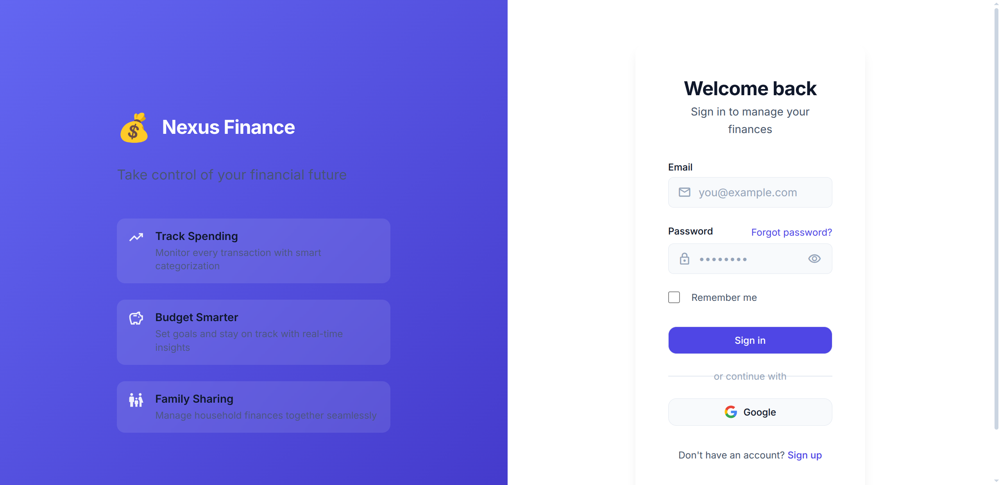

## Step 4: Unknown goal

**URL:** https://nexus-finance-6c6c6.web.app/auth/register

**Action:** click

**Details:** {'click': {'index': 30}, 'interacted_element': DOMInteractedElement(node_id=460, backend_node_id=30, frame_id=None, node_type=<NodeType.ELEMENT_NODE: 1>, node_value='', node_name='A', attributes={'_ngcontent-ng-c756324021': '', 'routerlink': '/auth/register', 'href': 'https://nexus-finance-6c6c6.web.app/auth/register'}, bounds=DOMRect(x=1151.5893825289304, y=657.6250552868383, width=50.48214710119999, height=17.142858584065085), x_path='html/body/app-root/app-auth-layout/div/div[2]/div/app-login/div/form/p[2]/a', element_hash=911703250154670604, stable_hash=17052604314650528261, ax_name='Sign up')}

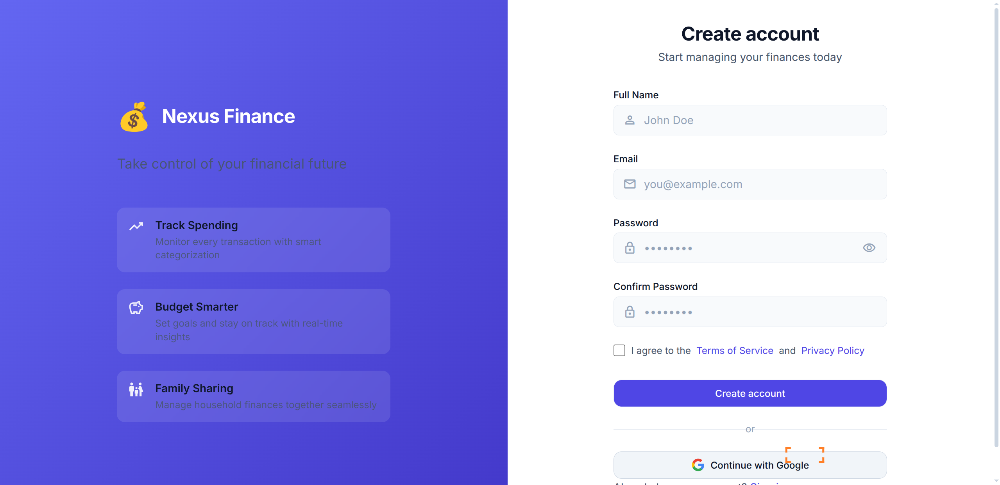

## Step 5: Unknown goal

**URL:** https://nexus-finance-6c6c6.web.app/auth/register

**Action:** save_as_pdf

**Details:** {'save_as_pdf': {'file_name': '02_signup_page', 'print_background': True, 'landscape': False, 'scale': 1.0, 'paper_format': 'Letter'}, 'interacted_element': None}

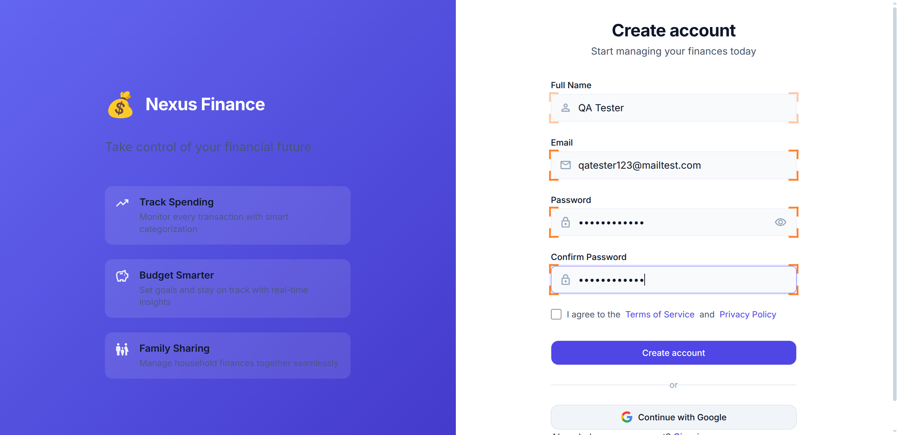

## Step 6: Unknown goal

**URL:** https://nexus-finance-6c6c6.web.app/auth/register

**Action:** input

**Details:** {'input': {'index': 201, 'text': 'QA Tester', 'clear': True}, 'interacted_element': DOMInteractedElement(node_id=583, backend_node_id=201, frame_id=None, node_type=<NodeType.ELEMENT_NODE: 1>, node_value='', node_name='INPUT', attributes={'_ngcontent-ng-c1444638454': '', 'type': 'text', 'id': 'displayName', 'formcontrolname': 'displayName', 'placeholder': 'John Doe', 'class': 'form-input ng-untouched ng-pristine ng-invalid'}, bounds=DOMRect(x=897.0000754112054, y=153.5982271987873, width=400.0000336281853, height=44.571432318569215), x_path='html/body/app-root/app-auth-layout/div/div[2]/div/app-register/div/form/div[1]/div/input', element_hash=752970957094333201, stable_hash=12904640149379612923, ax_name='Full Name')}

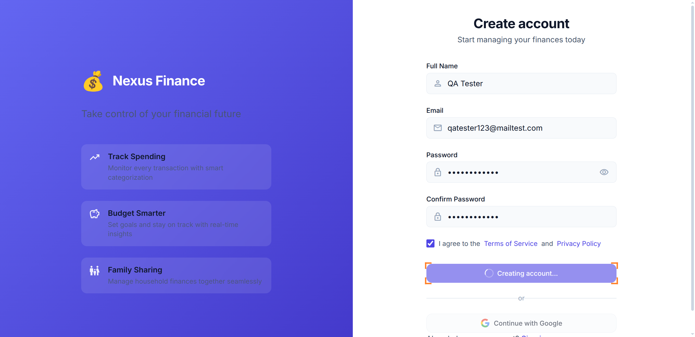

## Step 7: Unknown goal

**URL:** https://nexus-finance-6c6c6.web.app/onboarding

**Action:** input

**Details:** {'input': {'index': 208, 'text': 'qatester123@mailtest.com', 'clear': True}, 'interacted_element': DOMInteractedElement(node_id=595, backend_node_id=208, frame_id=None, node_type=<NodeType.ELEMENT_NODE: 1>, node_value='', node_name='INPUT', attributes={'_ngcontent-ng-c1444638454': '', 'type': 'email', 'id': 'email', 'formcontrolname': 'email', 'placeholder': 'you@example.com', 'class': 'form-input ng-untouched ng-pristine ng-invalid'}, bounds=DOMRect(x=897.0000754112054, y=247.16966363680922, width=400.0000336281853, height=44.571432318569215), x_path='html/body/app-root/app-auth-layout/div/div[2]/div/app-register/div/form/div[2]/div/input', element_hash=2596530517521917623, stable_hash=13412341923848201671, ax_name='Email')}

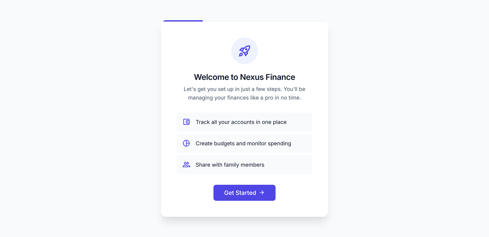

## Step 8: Unknown goal

**URL:** https://nexus-finance-6c6c6.web.app/onboarding

**Action:** input

**Details:** {'input': {'index': 213, 'text': 'TestPass123!', 'clear': True}, 'interacted_element': DOMInteractedElement(node_id=607, backend_node_id=213, frame_id=None, node_type=<NodeType.ELEMENT_NODE: 1>, node_value='', node_name='INPUT', attributes={'_ngcontent-ng-c1444638454': '', 'id': 'password', 'formcontrolname': 'password', 'placeholder': '••••••••', 'class': 'form-input ng-untouched ng-pristine ng-invalid', 'type': 'password'}, bounds=DOMRect(x=897.0000754112054, y=340.74110007483114, width=400.0000336281853, height=44.571432318569215), x_path='html/body/app-root/app-auth-layout/div/div[2]/div/app-register/div/form/div[3]/div/input', element_hash=6465537599864926553, stable_hash=7230409012521526427, ax_name='Password')}

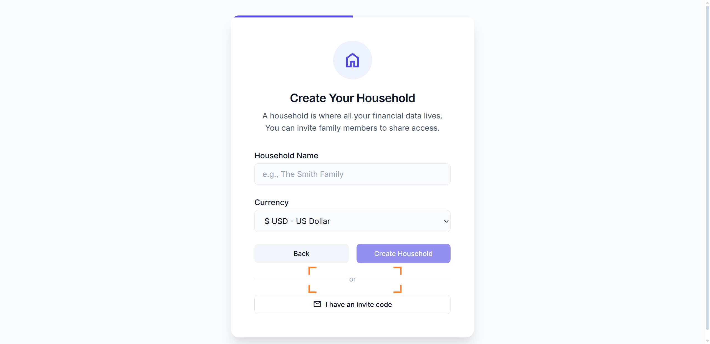

## Step 9: Unknown goal

**URL:** https://nexus-finance-6c6c6.web.app/onboarding

**Action:** input

**Details:** {'input': {'index': 222, 'text': 'TestPass123!', 'clear': True}, 'interacted_element': DOMInteractedElement(node_id=622, backend_node_id=222, frame_id=None, node_type=<NodeType.ELEMENT_NODE: 1>, node_value='', node_name='INPUT', attributes={'_ngcontent-ng-c1444638454': '', 'type': 'password', 'id': 'confirmPassword', 'formcontrolname': 'confirmPassword', 'placeholder': '••••••••', 'class': 'form-input ng-untouched ng-pristine ng-invalid'}, bounds=DOMRect(x=897.0000754112054, y=434.31253651285306, width=400.0000336281853, height=44.571432318569215), x_path='html/body/app-root/app-auth-layout/div/div[2]/div/app-register/div/form/div[4]/div/input', element_hash=1694870570636408912, stable_hash=4879056167325413532, ax_name='Confirm Password')}

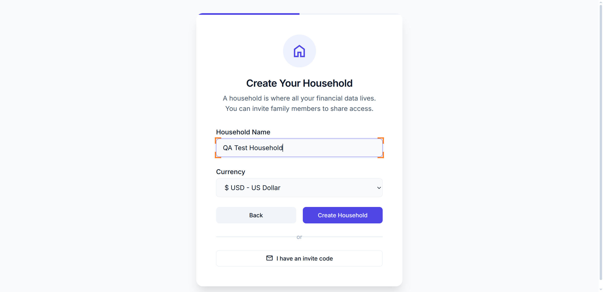

## Step 10: Unknown goal

**URL:** https://nexus-finance-6c6c6.web.app/onboarding

**Action:** click

**Details:** {'click': {'index': 225}, 'interacted_element': DOMInteractedElement(node_id=834, backend_node_id=225, frame_id=None, node_type=<NodeType.ELEMENT_NODE: 1>, node_value='', node_name='INPUT', attributes={'_ngcontent-ng-c1444638454': '', 'type': 'checkbox', 'formcontrolname': 'acceptTerms', 'class': 'ng-untouched ng-pristine ng-invalid'}, bounds=DOMRect(x=897.0000754112054, y=504.3839709752191, width=18.000001513268337, height=18.000001513268337), x_path='html/body/app-root/app-auth-layout/div/div[2]/div/app-register/div/form/div[5]/label/input', element_hash=3758886100673289151, stable_hash=17329823655781736387, ax_name='I agree to the Terms of Service and Privacy Policy')}

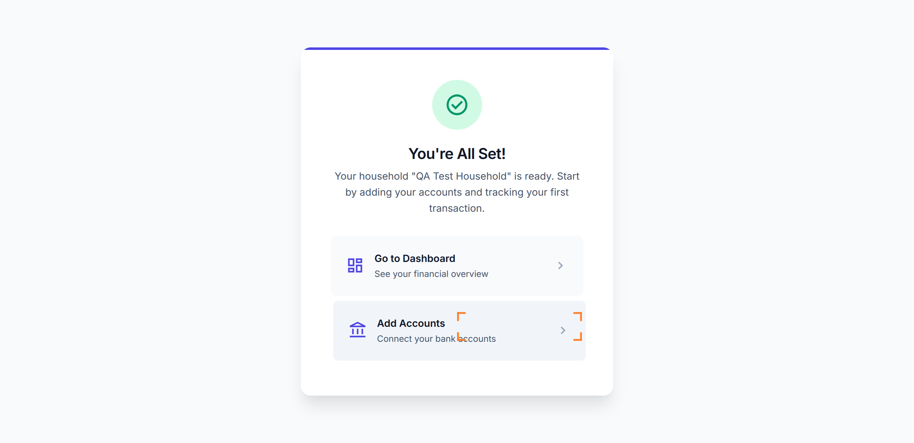

## Step 11: Unknown goal

**URL:** https://nexus-finance-6c6c6.web.app/dashboard

**Action:** click

**Details:** {'click': {'index': 228}, 'interacted_element': DOMInteractedElement(node_id=842, backend_node_id=228, frame_id=None, node_type=<NodeType.ELEMENT_NODE: 1>, node_value='', node_name='BUTTON', attributes={'_ngcontent-ng-c1444638454': '', 'type': 'submit', 'class': 'btn btn-primary btn-block'}, bounds=DOMRect(x=897.0000754112054, y=555.8839753048479, width=400.0000336281853, height=40.000003362818525), x_path='html/body/app-root/app-auth-layout/div/div[2]/div/app-register/div/form/button[1]', element_hash=4527644406409390173, stable_hash=1164730894949480476, ax_name='Create account')}

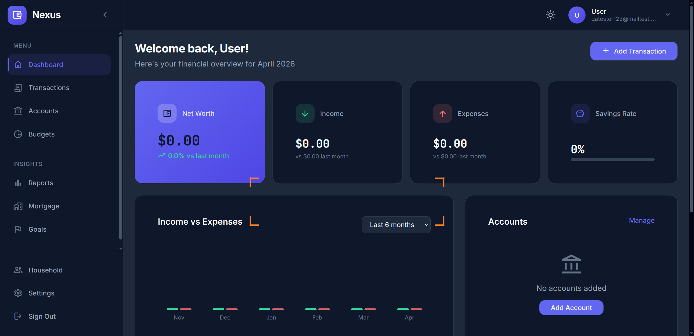

## Step 12: Unknown goal

**URL:** https://nexus-finance-6c6c6.web.app/dashboard

**Action:** wait

**Details:** {'wait': {'seconds': 4}, 'interacted_element': None}

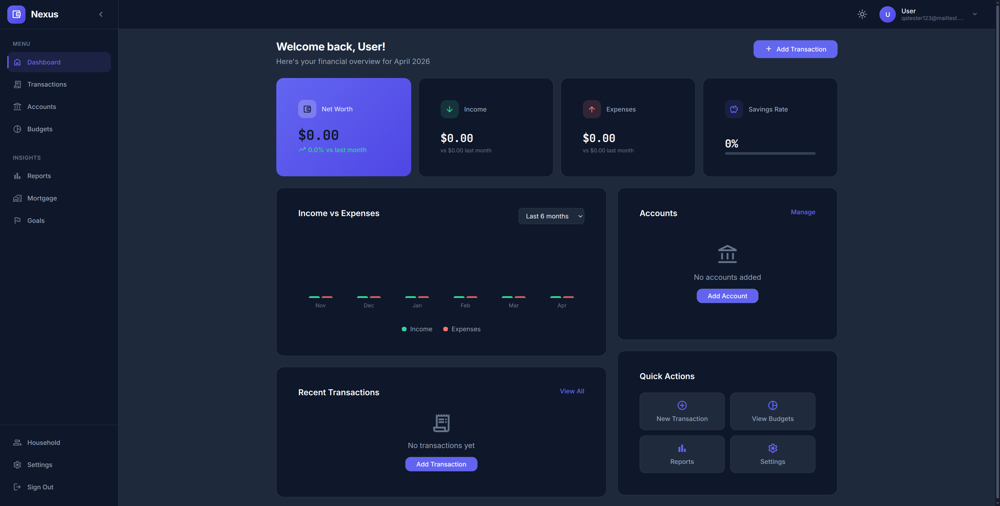

## Step 13: Unknown goal

**URL:** https://nexus-finance-6c6c6.web.app/transactions

**Action:** save_as_pdf

**Details:** {'save_as_pdf': {'file_name': '03_onboarding_welcome.pdf', 'print_background': True, 'landscape': False, 'scale': 1.0, 'paper_format': 'Letter'}, 'interacted_element': None}

## Step 14: Unknown goal

**URL:** https://nexus-finance-6c6c6.web.app/transactions

**Action:** click

**Details:** {'click': {'index': 345}, 'interacted_element': DOMInteractedElement(node_id=1178, backend_node_id=345, frame_id=None, node_type=<NodeType.ELEMENT_NODE: 1>, node_value='', node_name='BUTTON', attributes={'_ngcontent-ng-c2911269319': '', 'class': 'btn btn-primary btn-lg'}, bounds=DOMRect(x=638.2589514062664, y=553.741091239634, width=185.75893521728156, height=48.00000171728458), x_path='html/body/app-root/app-onboarding/div/div/div[2]/button', element_hash=2300399357913039909, stable_hash=15157241430263588040, ax_name='Get Started arrow_forward')}

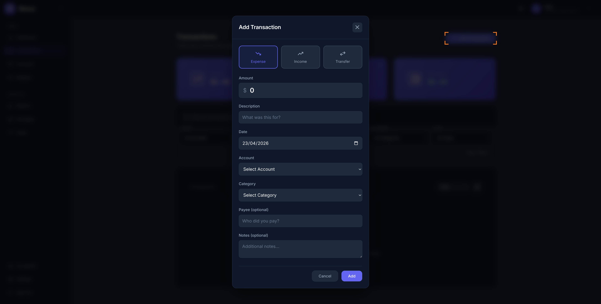

## Step 15: Unknown goal

**URL:** https://nexus-finance-6c6c6.web.app/transactions

**Action:** save_as_pdf

**Details:** {'save_as_pdf': {'file_name': '04_onboarding_create_household', 'print_background': True, 'landscape': False, 'scale': 1.0, 'paper_format': 'Letter'}, 'interacted_element': None}

## Step 16: Unknown goal

**URL:** https://nexus-finance-6c6c6.web.app/transactions

**Action:** input

**Details:** {'input': {'index': 375, 'text': 'QA Test Household', 'clear': True}, 'interacted_element': DOMInteractedElement(node_id=1262, backend_node_id=375, frame_id=None, node_type=<NodeType.ELEMENT_NODE: 1>, node_value='', node_name='INPUT', attributes={'_ngcontent-ng-c2911269319': '', 'type': 'text', 'placeholder': 'e.g., The Smith Family', 'class': 'form-input ng-untouched ng-pristine ng-valid'}, bounds=DOMRect(x=524.0000440529227, y=337.1964569196885, width=404.00003396446715, height=44.571432318569215), x_path='html/body/app-root/app-onboarding/div/div/div[2]/div[2]/input', element_hash=2240780086590064313, stable_hash=15543912360366814290, ax_name='e.g., The Smith Family')}

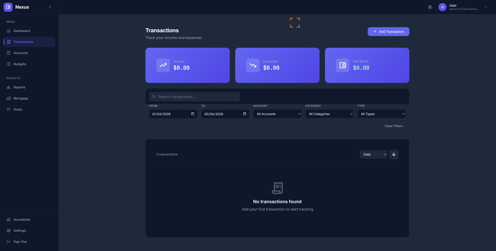

## Step 17: Unknown goal

**URL:** https://nexus-finance-6c6c6.web.app/accounts

**Action:** save_as_pdf

**Details:** {'save_as_pdf': {'file_name': '04_onboarding_create_household_filled', 'print_background': True, 'landscape': False, 'scale': 1.0, 'paper_format': 'Letter'}, 'interacted_element': None}

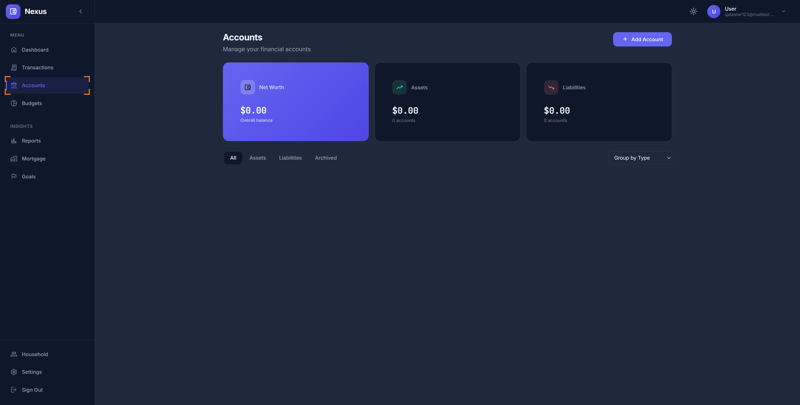

## Step 18: Unknown goal

**URL:** https://nexus-finance-6c6c6.web.app/accounts/new

**Action:** click

**Details:** {'click': {'index': 405}, 'interacted_element': DOMInteractedElement(node_id=1472, backend_node_id=405, frame_id=None, node_type=<NodeType.ELEMENT_NODE: 1>, node_value='', node_name='BUTTON', attributes={'_ngcontent-ng-c2911269319': '', 'class': 'btn btn-primary'}, bounds=DOMRect(x=734.00006170772, y=503.4821851851198, width=194.00001630966986, height=40.000003362818525), x_path='html/body/app-root/app-onboarding/div/div/div[2]/div[4]/button[2]', element_hash=1848443776164791573, stable_hash=11071815813019567377, ax_name='Create Household')}

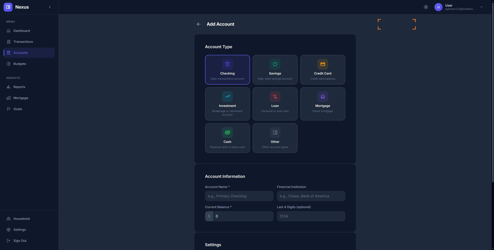

## Step 19: Unknown goal

**URL:** https://nexus-finance-6c6c6.web.app/accounts/new

**Action:** save_as_pdf

**Details:** {'save_as_pdf': {'file_name': '05_onboarding_complete.pdf', 'print_background': True, 'landscape': False, 'scale': 1.0, 'paper_format': 'Letter'}, 'interacted_element': None}

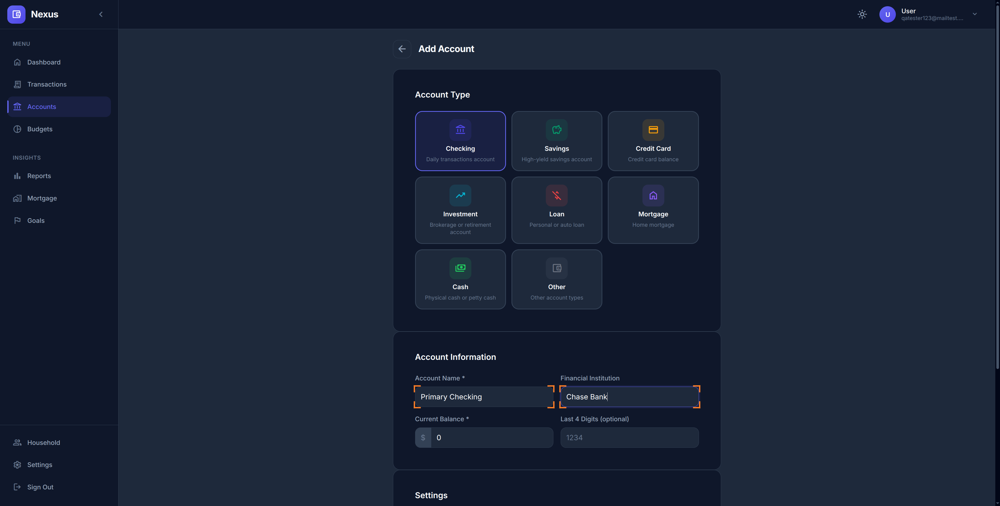

## Step 20: Unknown goal

**URL:** https://nexus-finance-6c6c6.web.app/accounts/uks5VkJaKBTZUV4Up9rY

**Action:** click

**Details:** {'click': {'index': 473}, 'interacted_element': DOMInteractedElement(node_id=1570, backend_node_id=473, frame_id=None, node_type=<NodeType.ELEMENT_NODE: 1>, node_value='', node_name='DIV', attributes={'_ngcontent-ng-c2911269319': '', 'class': 'next-step'}, bounds=DOMRect(x=529.1428760738753, y=378.5446564002445, width=404.0000144538119, height=96.00893200631717), x_path='html/body/app-root/app-onboarding/div/div/div[2]/div[2]/div[1]', element_hash=1446194887491861005, stable_hash=15281252942774024711, ax_name=None)}

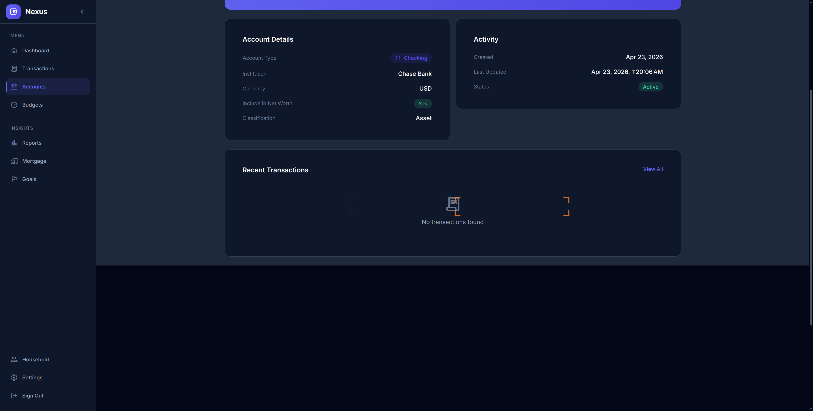

## Step 21: Unknown goal

**URL:** https://nexus-finance-6c6c6.web.app/accounts/uks5VkJaKBTZUV4Up9rY

**Action:** save_as_pdf

**Details:** {'save_as_pdf': {'file_name': '06_dashboard.pdf', 'print_background': True, 'landscape': False, 'scale': 0.8, 'paper_format': 'A4'}, 'interacted_element': None}

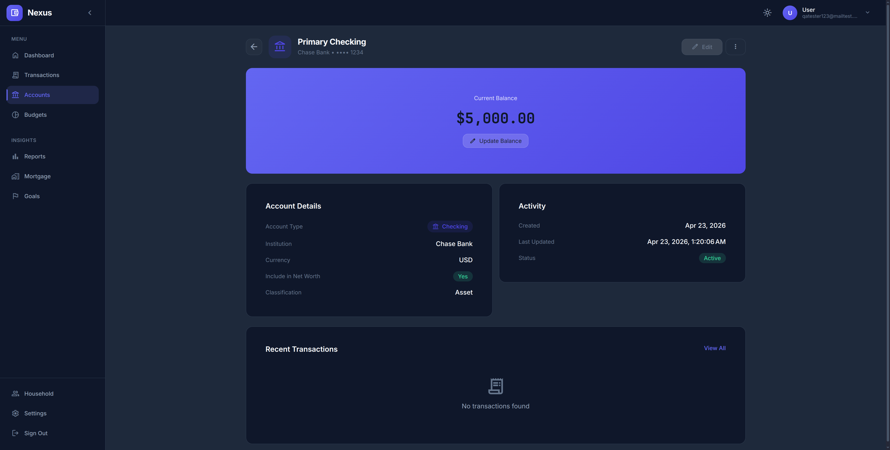

## Step 22: Unknown goal

**URL:** https://nexus-finance-6c6c6.web.app/budgets

**Action:** click

**Details:** {'click': {'index': 555}, 'interacted_element': DOMInteractedElement(node_id=2117, backend_node_id=555, frame_id=None, node_type=<NodeType.ELEMENT_NODE: 1>, node_value='', node_name='A', attributes={'_ngcontent-ng-c1530555886': '', 'routerlinkactive': 'active', 'class': 'nav-item', 'href': 'https://nexus-finance-6c6c6.web.app/transactions'}, bounds=DOMRect(x=16.0, y=163.0, width=227.42857142857142, height=45.0), x_path='html/body/app-root/app-main-layout/div/aside/nav/div[1]/a[2]', element_hash=7427551189070062567, stable_hash=7427551189070062567, ax_name='receipt_long Transactions')}

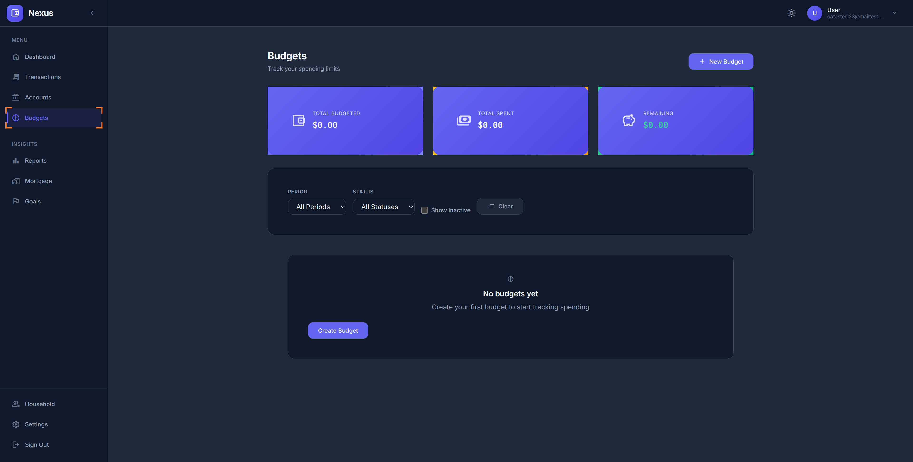

## Step 23: Unknown goal

**URL:** https://nexus-finance-6c6c6.web.app/budgets

**Action:** save_as_pdf

**Details:** {'save_as_pdf': {'file_name': '07_transactions_page.pdf', 'print_background': True, 'landscape': False, 'scale': 1.0, 'paper_format': 'Letter'}, 'interacted_element': None}

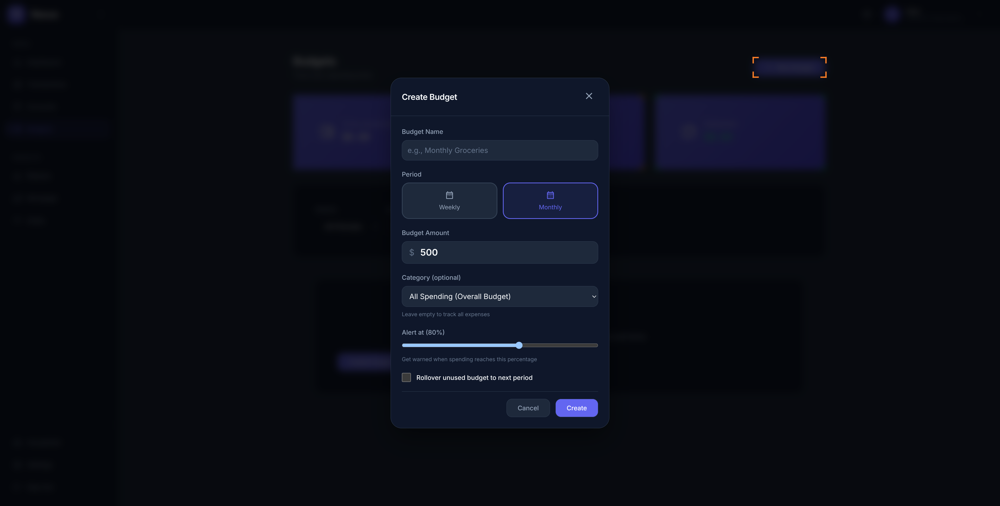

## Step 24: Unknown goal

**URL:** https://nexus-finance-6c6c6.web.app/budgets

**Action:** click

**Details:** {'click': {'index': 1065}, 'interacted_element': DOMInteractedElement(node_id=2637, backend_node_id=1065, frame_id=None, node_type=<NodeType.ELEMENT_NODE: 1>, node_value='', node_name='BUTTON', attributes={'_ngcontent-ng-c3928296004': '', 'class': 'btn btn-primary'}, bounds=DOMRect(x=1626.3215578198433, y=120.00000953674316, width=184.82144325971603, height=40.00000317891439), x_path='html/body/app-root/app-main-layout/div/div/main/app-transaction-list/div/header/button', element_hash=1104866004922658679, stable_hash=10328238041777434483, ax_name='add Add Transaction')}

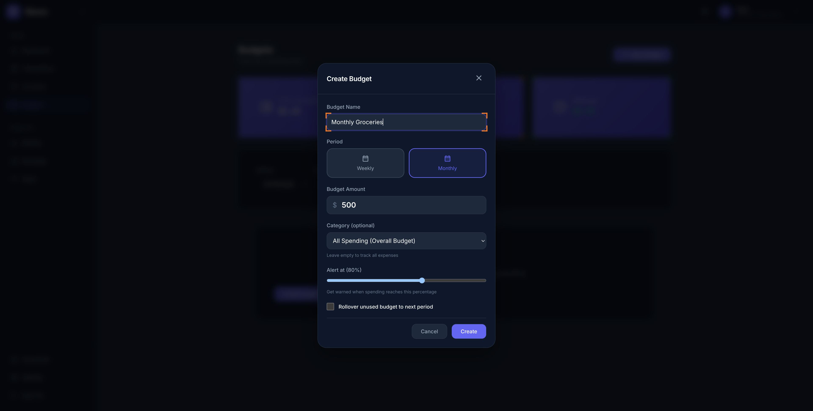

## Step 25: Unknown goal

**URL:** https://nexus-finance-6c6c6.web.app/budgets

**Action:** save_as_pdf

**Details:** {'save_as_pdf': {'file_name': '08_add_transaction_modal.pdf', 'print_background': True, 'landscape': False, 'scale': 1.0, 'paper_format': 'Letter'}, 'interacted_element': None}

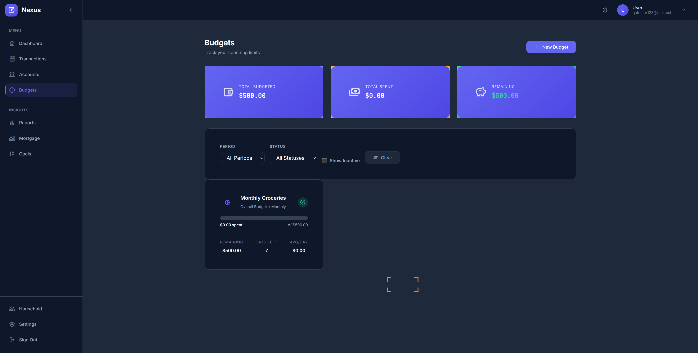

## Step 26: Unknown goal

**URL:** https://nexus-finance-6c6c6.web.app/reports

**Action:** click

**Details:** {'click': {'index': 1473}, 'interacted_element': DOMInteractedElement(node_id=4297, backend_node_id=1473, frame_id=None, node_type=<NodeType.ELEMENT_NODE: 1>, node_value='', node_name='BUTTON', attributes={'_ngcontent-ng-c3928296004': '', 'aria-label': 'Close dialog', 'class': 'close-btn'}, bounds=DOMRect(x=1286.5715308189392, y=82.0714350938797, width=36.00000286102295, height=36.00000286102295), x_path='html/body/app-root/app-main-layout/div/div/main/app-transaction-list/div/div[3]/div/header/button', element_hash=3162617917481154227, stable_hash=3162617917481154227, ax_name='Close dialog')}

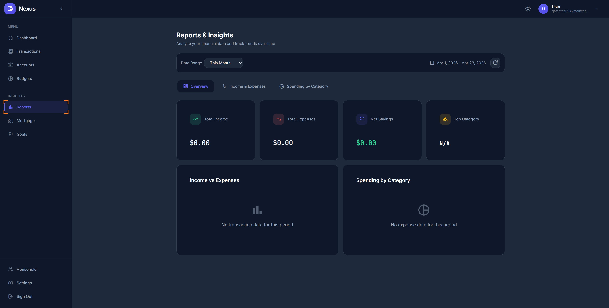

## Step 27: Unknown goal

**URL:** https://nexus-finance-6c6c6.web.app/reports

**Action:** click

**Details:** {'click': {'index': 558}, 'interacted_element': DOMInteractedElement(node_id=4596, backend_node_id=558, frame_id=None, node_type=<NodeType.ELEMENT_NODE: 1>, node_value='', node_name='A', attributes={'_ngcontent-ng-c1530555886': '', 'routerlinkactive': 'active', 'class': 'nav-item', 'href': 'https://nexus-finance-6c6c6.web.app/accounts'}, bounds=DOMRect(x=16.000001271565758, y=212.00001684824628, width=227.4285895029704, height=45.00000357627869), x_path='html/body/app-root/app-main-layout/div/aside/nav/div[1]/a[3]', element_hash=2207958665784183128, stable_hash=13737173711852652883, ax_name='account_balance Accounts')}

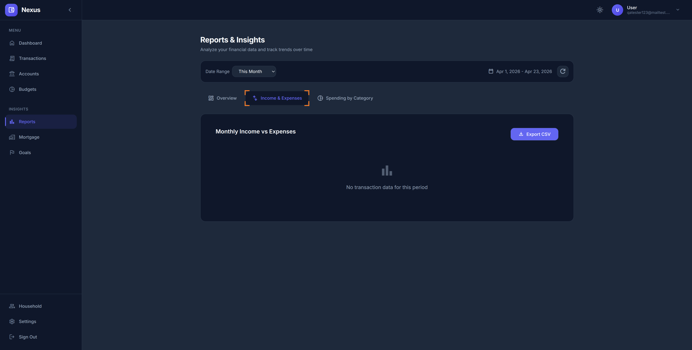

## Step 28: Unknown goal

**URL:** https://nexus-finance-6c6c6.web.app/reports

**Action:** save_as_pdf

**Details:** {'save_as_pdf': {'file_name': '09_accounts_page.pdf', 'print_background': True, 'landscape': False, 'scale': 1.0, 'paper_format': 'Letter'}, 'interacted_element': None}

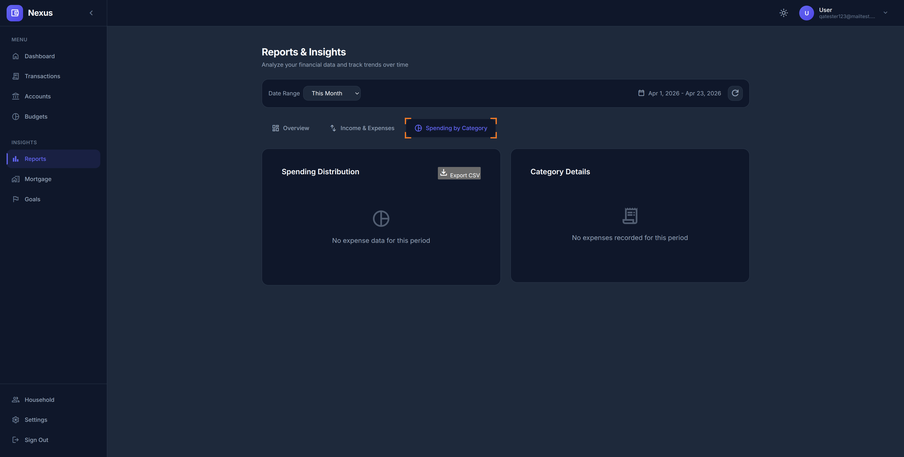

## Step 29: Unknown goal

**URL:** https://nexus-finance-6c6c6.web.app/mortgages

**Action:** click

**Details:** {'click': {'index': 1855}, 'interacted_element': DOMInteractedElement(node_id=5230, backend_node_id=1855, frame_id=None, node_type=<NodeType.ELEMENT_NODE: 1>, node_value='', node_name='BUTTON', attributes={'_ngcontent-ng-c3484471092': '', 'routerlink': 'new', 'class': 'btn btn-primary', 'tabindex': '0'}, bounds=DOMRect(x=1681.0804907431207, y=88.00000699361166, width=162.06251287957033, height=40.00000317891439), x_path='html/body/app-root/app-main-layout/div/div/main/app-account-list/div/header/button', element_hash=1527927367794085665, stable_hash=17668828432289943322, ax_name='add Add Account')}

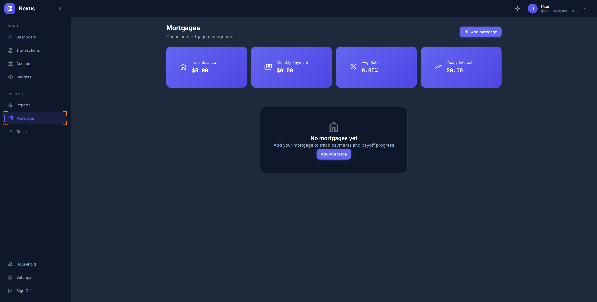

## Step 30: Unknown goal

**URL:** https://nexus-finance-6c6c6.web.app/mortgages

**Action:** save_as_pdf

**Details:** {'save_as_pdf': {'file_name': '10_add_account_page.pdf', 'print_background': True, 'landscape': False, 'scale': 1.0, 'paper_format': 'Letter'}, 'interacted_element': None}

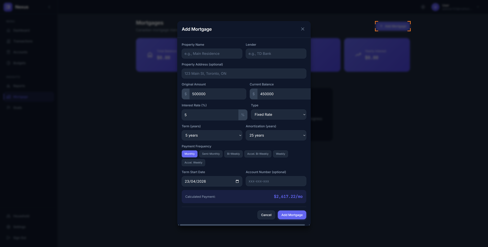

## Step 31: Unknown goal

**URL:** https://nexus-finance-6c6c6.web.app/mortgages

**Action:** input

**Details:** {'input': {'index': 1947, 'text': 'Primary Checking', 'clear': True}, 'interacted_element': DOMInteractedElement(node_id=5608, backend_node_id=1947, frame_id=None, node_type=<NodeType.ELEMENT_NODE: 1>, node_value='', node_name='INPUT', attributes={'_ngcontent-ng-c3719281990': '', 'id': 'name', 'type': 'text', 'formcontrolname': 'name', 'placeholder': 'e.g., Primary Checking', 'class': 'ng-untouched ng-pristine ng-invalid'}, bounds=DOMRect(x=910.5714285714286, y=849.6071428571429, width=303.42857142857144, height=44.57142857142857), x_path='html/body/app-root/app-main-layout/div/div/main/app-account-form/div/form/app-card[2]/div/div[2]/div/div[1]/input', element_hash=264720508853488489, stable_hash=13163283483711112093, ax_name='Account Name *')}

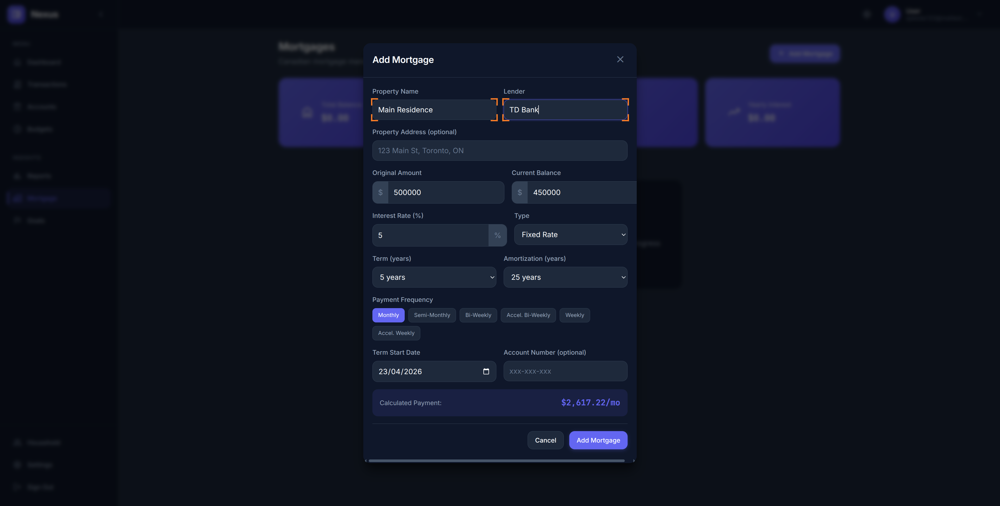

## Step 32: Unknown goal

**URL:** https://nexus-finance-6c6c6.web.app/mortgages

**Action:** input

**Details:** {'input': {'index': 1950, 'text': 'Chase Bank', 'clear': True}, 'interacted_element': DOMInteractedElement(node_id=5617, backend_node_id=1950, frame_id=None, node_type=<NodeType.ELEMENT_NODE: 1>, node_value='', node_name='INPUT', attributes={'_ngcontent-ng-c3719281990': '', 'id': 'institution', 'type': 'text', 'formcontrolname': 'institution', 'placeholder': 'e.g., Chase, Bank of America', 'class': 'ng-untouched ng-pristine ng-valid'}, bounds=DOMRect(x=1230.0, y=849.6071428571429, width=303.42857142857144, height=44.57142857142857), x_path='html/body/app-root/app-main-layout/div/div/main/app-account-form/div/form/app-card[2]/div/div[2]/div/div[2]/input', element_hash=9180690391037439930, stable_hash=14345417768132306960, ax_name='Financial Institution')}

## Step 33: Unknown goal

**URL:** https://nexus-finance-6c6c6.web.app/goals

**Action:** input

**Details:** {'input': {'index': 1960, 'text': '5000', 'clear': True}, 'interacted_element': DOMInteractedElement(node_id=5987, backend_node_id=1960, frame_id=None, node_type=<NodeType.ELEMENT_NODE: 1>, node_value='', node_name='INPUT', attributes={'_ngcontent-ng-c3719281990': '', 'id': 'balance', 'type': 'number', 'formcontrolname': 'balance', 'placeholder': '0.00', 'step': '0.01', 'class': 'ng-untouched ng-pristine ng-valid'}, bounds=DOMRect(x=945.4821428571429, y=939.1785714285714, width=268.51785714285717, height=44.57142857142857), x_path='html/body/app-root/app-main-layout/div/div/main/app-account-form/div/form/app-card[2]/div/div[2]/div/div[3]/div/input', element_hash=2815159874006747295, stable_hash=7483380597260785485, ax_name='Current Balance *')}

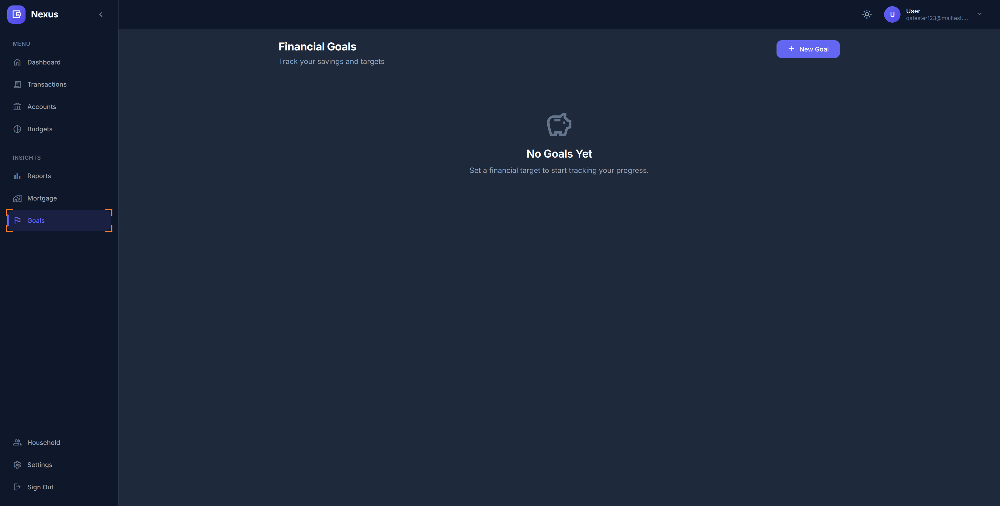

## Step 34: Unknown goal

**URL:** https://nexus-finance-6c6c6.web.app/goals

**Action:** input

**Details:** {'input': {'index': 1963, 'text': '1234', 'clear': True}, 'interacted_element': DOMInteractedElement(node_id=6001, backend_node_id=1963, frame_id=None, node_type=<NodeType.ELEMENT_NODE: 1>, node_value='', node_name='INPUT', attributes={'_ngcontent-ng-c3719281990': '', 'id': 'accountNumber', 'type': 'text', 'formcontrolname': 'accountNumber', 'placeholder': '1234', 'maxlength': '4', 'class': 'ng-untouched ng-pristine ng-valid'}, bounds=DOMRect(x=1230.0, y=939.1785714285714, width=303.42857142857144, height=44.57142857142857), x_path='html/body/app-root/app-main-layout/div/div/main/app-account-form/div/form/app-card[2]/div/div[2]/div/div[4]/input', element_hash=6053796697830945249, stable_hash=742426786696114768, ax_name='Last 4 Digits (optional)')}

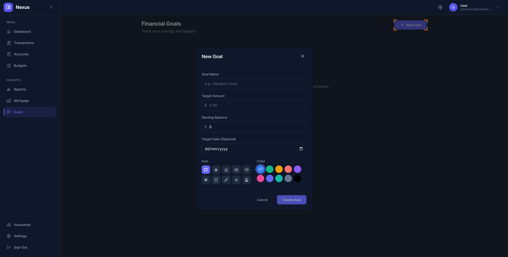

## Step 35: Unknown goal

**URL:** https://nexus-finance-6c6c6.web.app/goals

**Action:** click

**Details:** {'click': {'index': 1975}, 'interacted_element': DOMInteractedElement(node_id=6048, backend_node_id=1975, frame_id=None, node_type=<NodeType.ELEMENT_NODE: 1>, node_value='', node_name='BUTTON', attributes={'_ngcontent-ng-c3719281990': '', 'type': 'submit', 'class': 'btn btn-primary'}, bounds=DOMRect(x=1428.5, y=1450.6785714285713, width=153.5, height=40.0), x_path='html/body/app-root/app-main-layout/div/div/main/app-account-form/div/form/div/button[2]', element_hash=539393762563854991, stable_hash=12068608808632324746, ax_name='Create Account')}

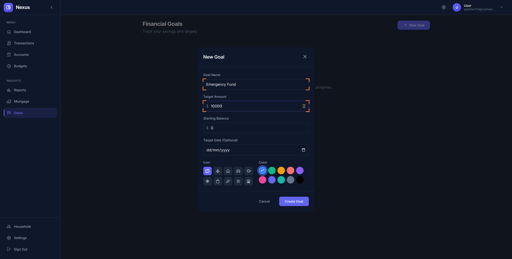

## Step 36: Unknown goal

**URL:** https://nexus-finance-6c6c6.web.app/goals

**Action:** scroll

**Details:** {'scroll': {'down': False, 'pages': 3.0}, 'interacted_element': None}

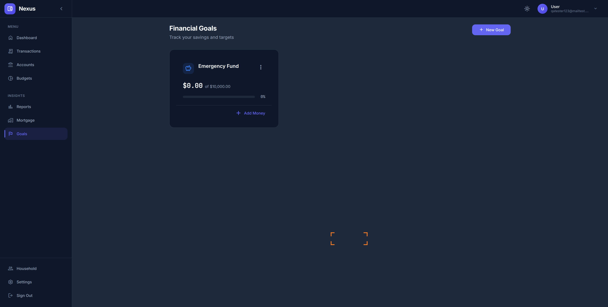

## Step 37: Unknown goal

**URL:** https://nexus-finance-6c6c6.web.app/goals

**Action:** save_as_pdf

**Details:** {'save_as_pdf': {'file_name': '11_account_detail_page.pdf', 'print_background': True, 'landscape': False, 'scale': 1.0, 'paper_format': 'Letter'}, 'interacted_element': None}

## Step 38: Unknown goal

**URL:** https://nexus-finance-6c6c6.web.app/goals

**Action:** click

**Details:** {'click': {'index': 561}, 'interacted_element': DOMInteractedElement(node_id=6493, backend_node_id=561, frame_id=None, node_type=<NodeType.ELEMENT_NODE: 1>, node_value='', node_name='A', attributes={'_ngcontent-ng-c1530555886': '', 'routerlinkactive': 'active', 'class': 'nav-item', 'href': 'https://nexus-finance-6c6c6.web.app/budgets'}, bounds=DOMRect(x=16.0, y=261.0, width=227.42857142857142, height=45.0), x_path='html/body/app-root/app-main-layout/div/aside/nav/div[1]/a[4]', element_hash=2058605347457783955, stable_hash=18199506411953641612, ax_name='pie_chart Budgets')}

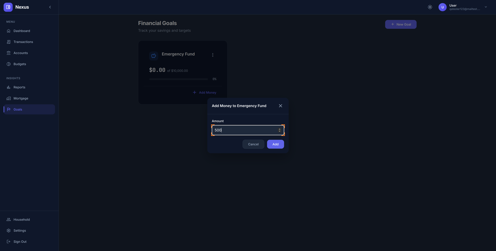

## Step 39: Unknown goal

**URL:** https://nexus-finance-6c6c6.web.app/goals

**Action:** save_as_pdf

**Details:** {'save_as_pdf': {'file_name': '12_budgets_page', 'print_background': True, 'landscape': False, 'scale': 1.0, 'paper_format': 'Letter'}, 'interacted_element': None}

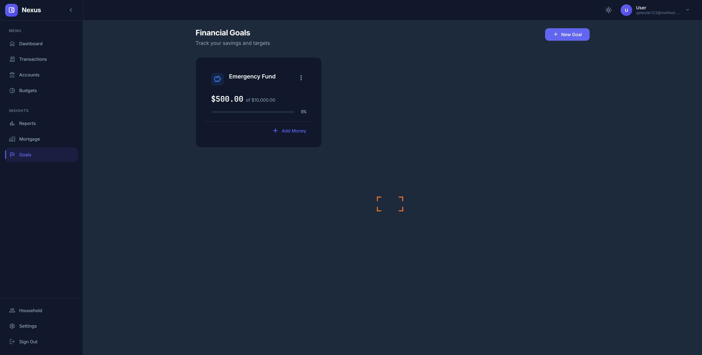

## Step 40: Unknown goal

**URL:** https://nexus-finance-6c6c6.web.app/goals

**Action:** click

**Details:** {'click': {'index': 2409}, 'interacted_element': DOMInteractedElement(node_id=6881, backend_node_id=2409, frame_id=None, node_type=<NodeType.ELEMENT_NODE: 1>, node_value='', node_name='BUTTON', attributes={'_ngcontent-ng-c3865637443': '', 'class': 'btn btn-primary'}, bounds=DOMRect(x=1654.1340600301824, y=128.19643875956535, width=157.00894104937714, height=40.00000317891439), x_path='html/body/app-root/app-main-layout/div/div/main/app-budget-list/div/header/button', element_hash=8515544103276443162, stable_hash=8515544103276443162, ax_name='add New Budget')}

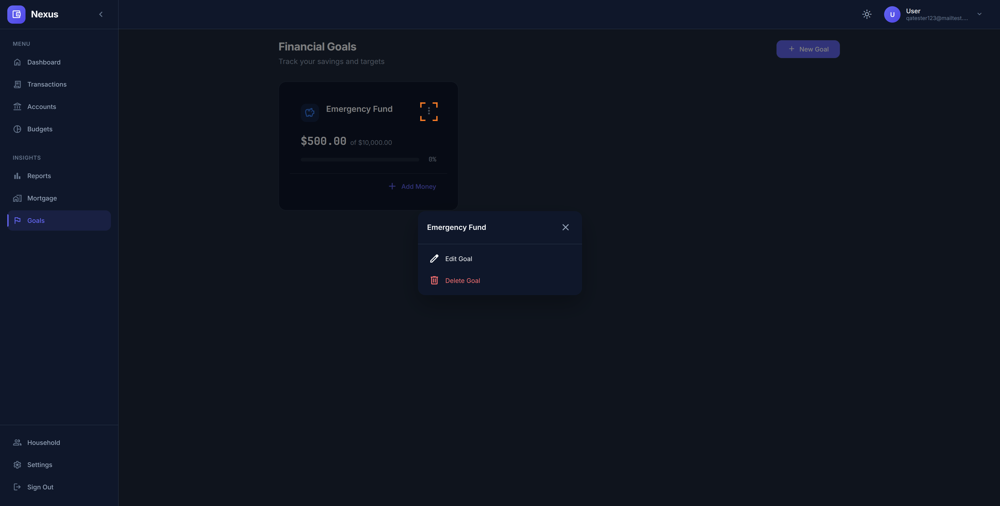

## Step 41: Unknown goal

**URL:** https://nexus-finance-6c6c6.web.app/goals

**Action:** save_as_pdf

**Details:** {'save_as_pdf': {'file_name': '13_create_budget_modal.pdf', 'print_background': True, 'landscape': False, 'scale': 1.0, 'paper_format': 'Letter'}, 'interacted_element': None}

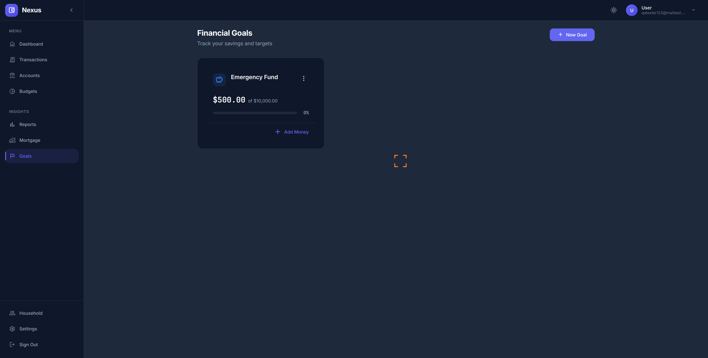

## Step 42: Unknown goal

**URL:** https://nexus-finance-6c6c6.web.app/household

**Action:** input

**Details:** {'input': {'index': 2561, 'text': 'Monthly Groceries', 'clear': True}, 'interacted_element': DOMInteractedElement(node_id=7358, backend_node_id=2561, frame_id=None, node_type=<NodeType.ELEMENT_NODE: 1>, node_value='', node_name='INPUT', attributes={'_ngcontent-ng-c3865637443': '', 'type': 'text', 'name': 'name', 'placeholder': 'e.g., Monthly Groceries', 'required': '', 'class': 'ng-untouched ng-pristine ng-invalid'}, bounds=DOMRect(x=881.7143557866415, y=307.71431016921997, width=430.85717709859216, height=44.57143211364746), x_path='html/body/app-root/app-main-layout/div/div/main/app-budget-list/div/div[3]/div/form/div[1]/input', element_hash=475647313454273492, stable_hash=1851258681871038571, ax_name='e.g., Monthly Groceries')}

## Step 43: Unknown goal

**URL:** https://nexus-finance-6c6c6.web.app/household

**Action:** click

**Details:** {'click': {'index': 2605}, 'interacted_element': DOMInteractedElement(node_id=8007, backend_node_id=2605, frame_id=None, node_type=<NodeType.ELEMENT_NODE: 1>, node_value='', node_name='BUTTON', attributes={'_ngcontent-ng-c3865637443': '', 'type': 'submit', 'class': 'btn btn-primary'}, bounds=DOMRect(x=1218.8483111510675, y=876.7143553892772, width=93.72322173416615, height=40.00000317891439), x_path='html/body/app-root/app-main-layout/div/div/main/app-budget-list/div/div[3]/div/form/div[7]/button[2]', element_hash=921431079336354159, stable_hash=12450646125404823914, ax_name='Create')}

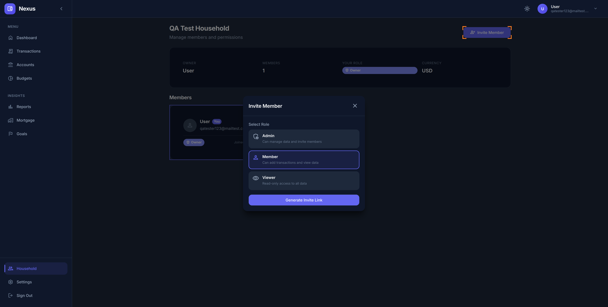

## Step 44: Unknown goal

**URL:** https://nexus-finance-6c6c6.web.app/household

**Action:** save_as_pdf

**Details:** {'save_as_pdf': {'file_name': '14_budgets_with_budget.pdf', 'print_background': True, 'landscape': False, 'scale': 1.0, 'paper_format': 'Letter'}, 'interacted_element': None}

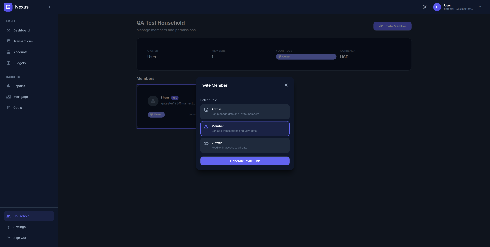

## Step 45: Unknown goal

**URL:** https://nexus-finance-6c6c6.web.app/household

**Action:** click

**Details:** {'click': {'index': 564}, 'interacted_element': DOMInteractedElement(node_id=8126, backend_node_id=564, frame_id=None, node_type=<NodeType.ELEMENT_NODE: 1>, node_value='', node_name='A', attributes={'_ngcontent-ng-c1530555886': '', 'routerlinkactive': 'active', 'class': 'nav-item', 'href': 'https://nexus-finance-6c6c6.web.app/reports'}, bounds=DOMRect(x=16.000001271565758, y=364.00002892812097, width=227.4285895029704, height=45.00000357627869), x_path='html/body/app-root/app-main-layout/div/aside/nav/div[2]/a[1]', element_hash=52929648955329359, stable_hash=52929648955329359, ax_name='bar_chart Reports')}

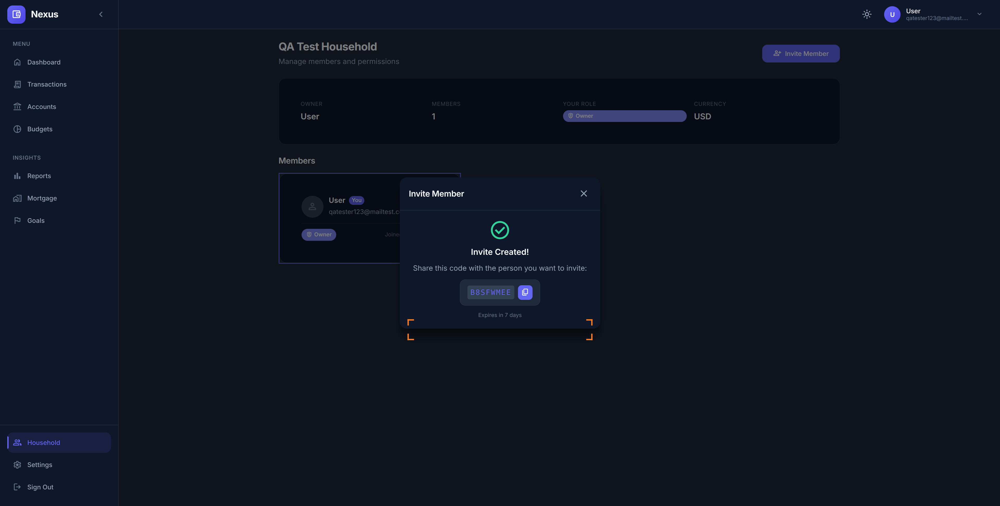

## Step 46: Unknown goal

**URL:** https://nexus-finance-6c6c6.web.app/household

**Action:** save_as_pdf

**Details:** {'save_as_pdf': {'file_name': '15_reports_overview.pdf', 'print_background': True, 'landscape': False, 'scale': 1.0, 'paper_format': 'Letter'}, 'interacted_element': None}

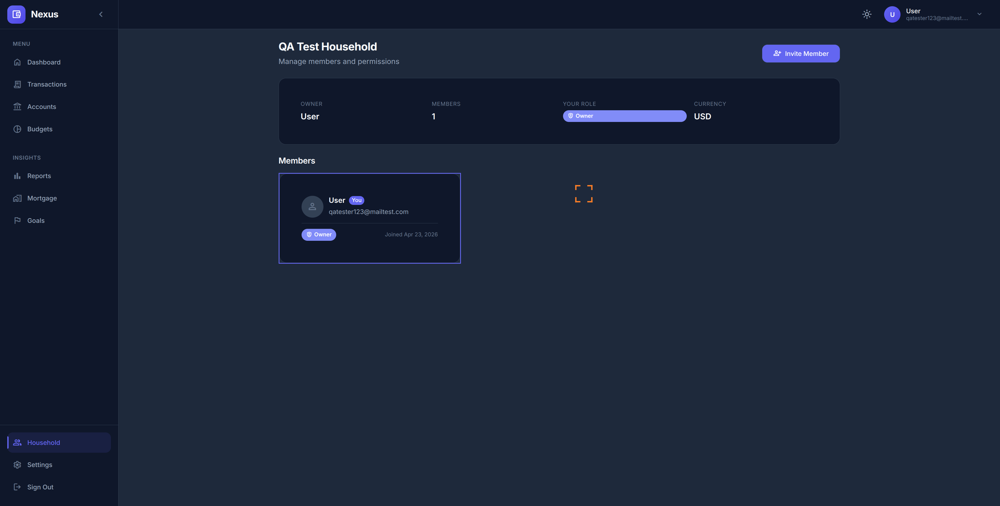

## Step 47: Unknown goal

**URL:** https://nexus-finance-6c6c6.web.app/settings

**Action:** click

**Details:** {'click': {'index': 2859}, 'interacted_element': DOMInteractedElement(node_id=8616, backend_node_id=2859, frame_id=None, node_type=<NodeType.ELEMENT_NODE: 1>, node_value='', node_name='BUTTON', attributes={'_ngcontent-ng-c2355221245': '', 'class': 'tab-btn'}, bounds=DOMRect(x=778.6875618845224, y=289.5357372959455, width=198.89287294944128, height=44.00000349680583), x_path='html/body/app-root/app-main-layout/div/div/main/app-reports/div/nav/button[2]', element_hash=1732860465662360483, stable_hash=17873761530158218140, ax_name='swap_vert Income & Expenses')}

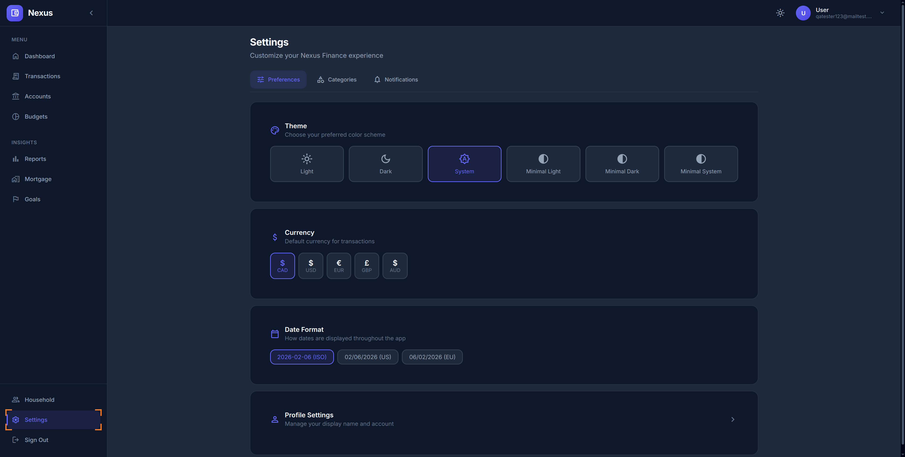

## Step 48: Unknown goal

**URL:** https://nexus-finance-6c6c6.web.app/settings

**Action:** save_as_pdf

**Details:** {'save_as_pdf': {'file_name': '16_reports_income_expenses.pdf', 'print_background': True, 'landscape': False, 'scale': 1.0, 'paper_format': 'Letter'}, 'interacted_element': None}

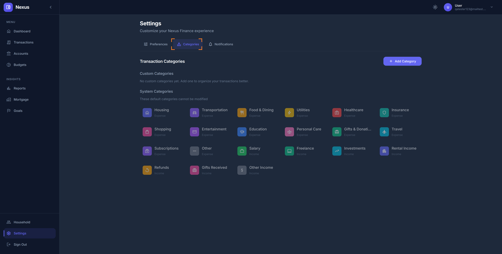

## Step 49: Unknown goal

**URL:** https://nexus-finance-6c6c6.web.app/settings

**Action:** click

**Details:** {'click': {'index': 2861}, 'interacted_element': DOMInteractedElement(node_id=8974, backend_node_id=2861, frame_id=None, node_type=<NodeType.ELEMENT_NODE: 1>, node_value='', node_name='BUTTON', attributes={'_ngcontent-ng-c2355221245': '', 'class': 'tab-btn'}, bounds=DOMRect(x=985.5804354697466, y=289.5357372959455, width=217.41966013610363, height=44.00000349680583), x_path='html/body/app-root/app-main-layout/div/div/main/app-reports/div/nav/button[3]', element_hash=5488451932743482671, stable_hash=5488451932743482671, ax_name='pie_chart Spending by Category')}

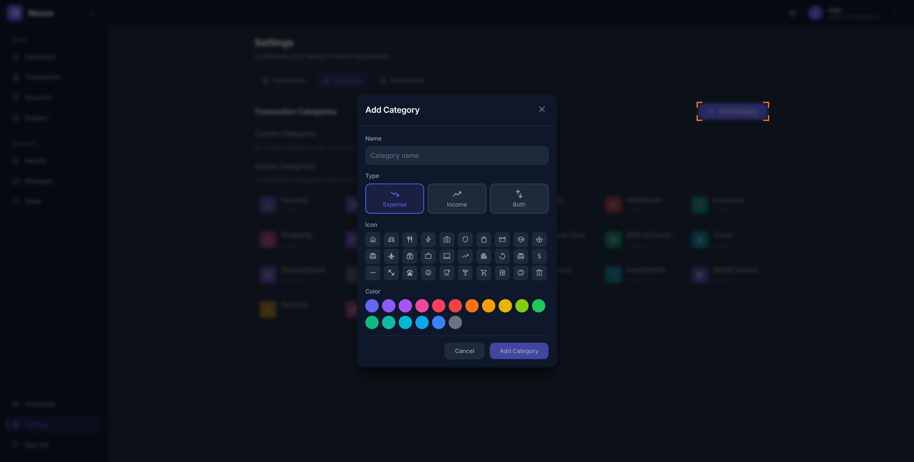

## Step 50: Unknown goal

**URL:** https://nexus-finance-6c6c6.web.app/settings

**Action:** save_as_pdf

**Details:** {'save_as_pdf': {'file_name': '17_reports_spending_by_category.pdf', 'print_background': True, 'landscape': False, 'scale': 1.0, 'paper_format': 'Letter'}, 'interacted_element': None}

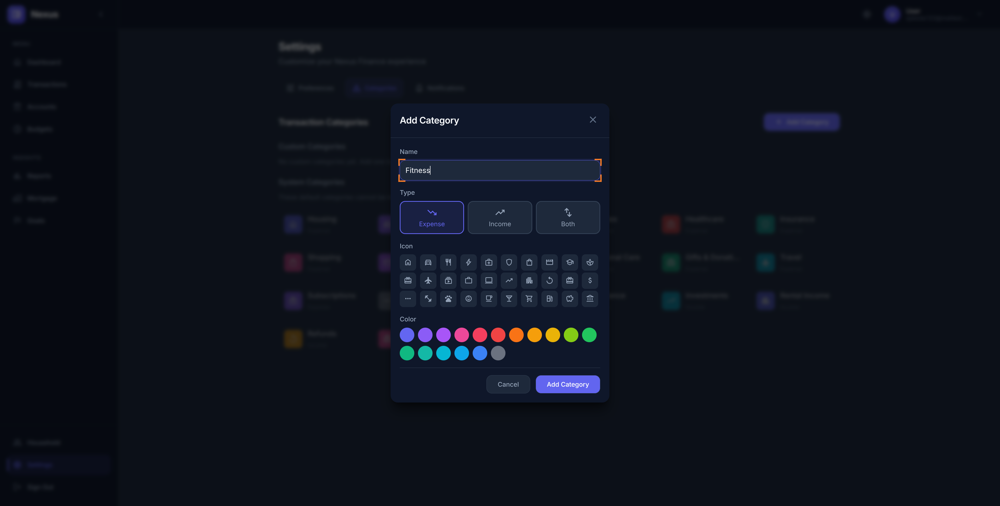

## Step 51: Unknown goal

**URL:** https://nexus-finance-6c6c6.web.app/settings

**Action:** click

**Details:** {'click': {'index': 567}, 'interacted_element': DOMInteractedElement(node_id=9128, backend_node_id=567, frame_id=None, node_type=<NodeType.ELEMENT_NODE: 1>, node_value='', node_name='A', attributes={'_ngcontent-ng-c1530555886': '', 'routerlinkactive': 'active', 'class': 'nav-item', 'href': 'https://nexus-finance-6c6c6.web.app/mortgages'}, bounds=DOMRect(x=16.000001271565758, y=413.0000328222911, width=227.4285895029704, height=45.00000357627869), x_path='html/body/app-root/app-main-layout/div/aside/nav/div[2]/a[2]', element_hash=1358148191721101467, stable_hash=12887363237789571222, ax_name='home_work Mortgage')}

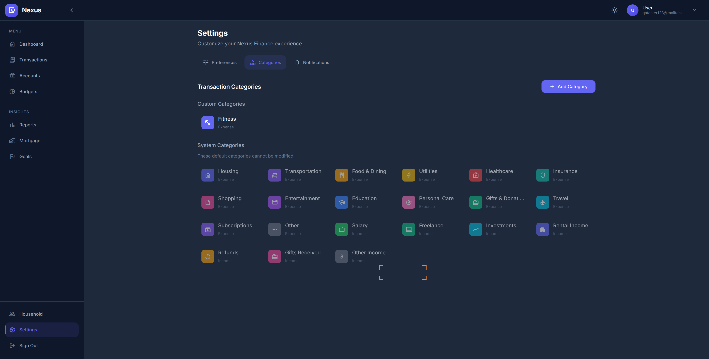

## Step 52: Unknown goal

**URL:** https://nexus-finance-6c6c6.web.app/settings

**Action:** save_as_pdf

**Details:** {'save_as_pdf': {'file_name': '18_mortgages_page.pdf', 'print_background': True, 'landscape': False, 'scale': 1.0, 'paper_format': 'Letter'}, 'interacted_element': None}

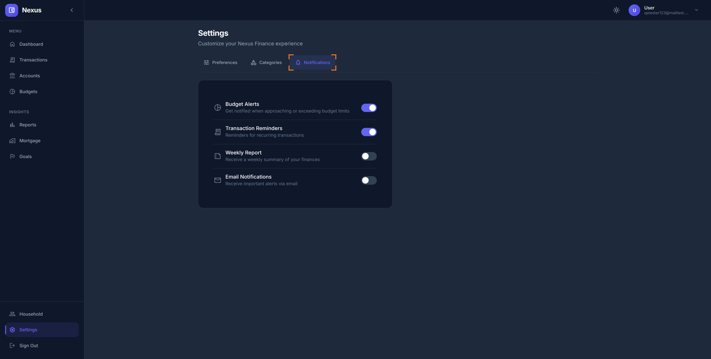

## Step 53: Unknown goal

**URL:** https://nexus-finance-6c6c6.web.app/settings

**Action:** click

**Details:** {'click': {'index': 3243}, 'interacted_element': DOMInteractedElement(node_id=9491, backend_node_id=3243, frame_id=None, node_type=<NodeType.ELEMENT_NODE: 1>, node_value='', node_name='BUTTON', attributes={'_ngcontent-ng-c2610227862': '', 'class': 'btn btn-primary'}, bounds=DOMRect(x=1689.232277105252, y=97.79465062916279, width=153.9107265174389, height=40.00000317891439), x_path='html/body/app-root/app-main-layout/div/div/main/app-mortgage-list/div/header/button', element_hash=935497620724911286, stable_hash=935497620724911286, ax_name='add Add Mortgage')}

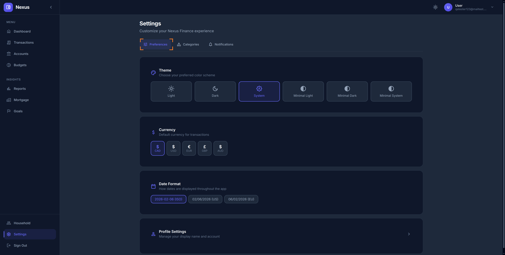

## Step 54: Unknown goal

**URL:** https://nexus-finance-6c6c6.web.app/settings/profile

**Action:** save_as_pdf

**Details:** {'save_as_pdf': {'file_name': '19_add_mortgage_modal.pdf', 'print_background': True, 'landscape': False, 'scale': 1.0, 'paper_format': 'Letter'}, 'interacted_element': None}

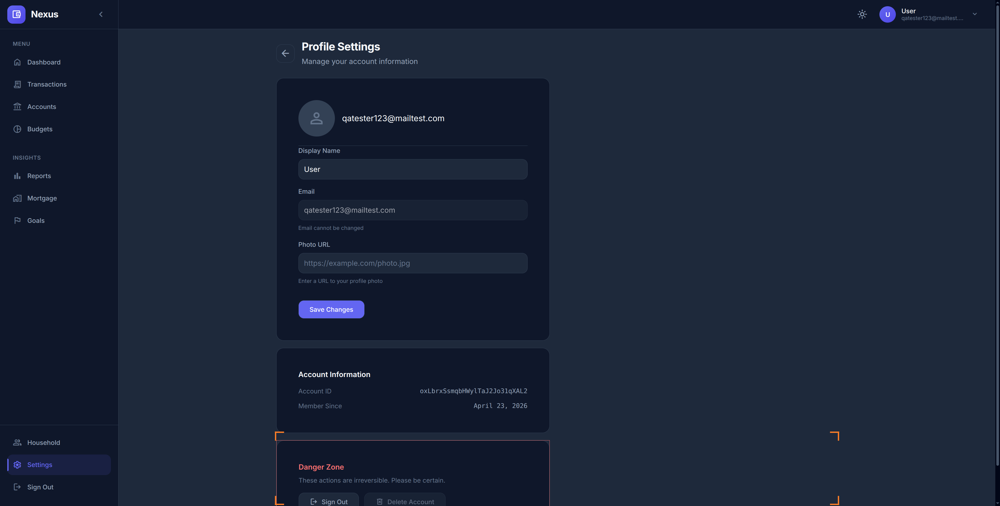

## Step 55: Unknown goal

**URL:** https://nexus-finance-6c6c6.web.app/settings/profile

**Action:** input

**Details:** {'input': {'index': 3309, 'text': 'Main Residence', 'clear': True}, 'interacted_element': DOMInteractedElement(node_id=9834, backend_node_id=3309, frame_id=None, node_type=<NodeType.ELEMENT_NODE: 1>, node_value='', node_name='INPUT', attributes={'_ngcontent-ng-c2610227862': '', 'type': 'text', 'name': 'propertyName', 'placeholder': 'e.g., Main Residence', 'required': '', 'class': 'ng-untouched ng-pristine ng-invalid'}, bounds=DOMRect(x=817.1429220835369, y=219.00001740455627, width=272.00002161661786, height=44.57143211364746), x_path='html/body/app-root/app-main-layout/div/div/main/app-mortgage-list/div/div[3]/div/form/div[1]/div[1]/input', element_hash=1490888050512852982, stable_hash=8531169801904326185, ax_name='e.g., Main Residence')}

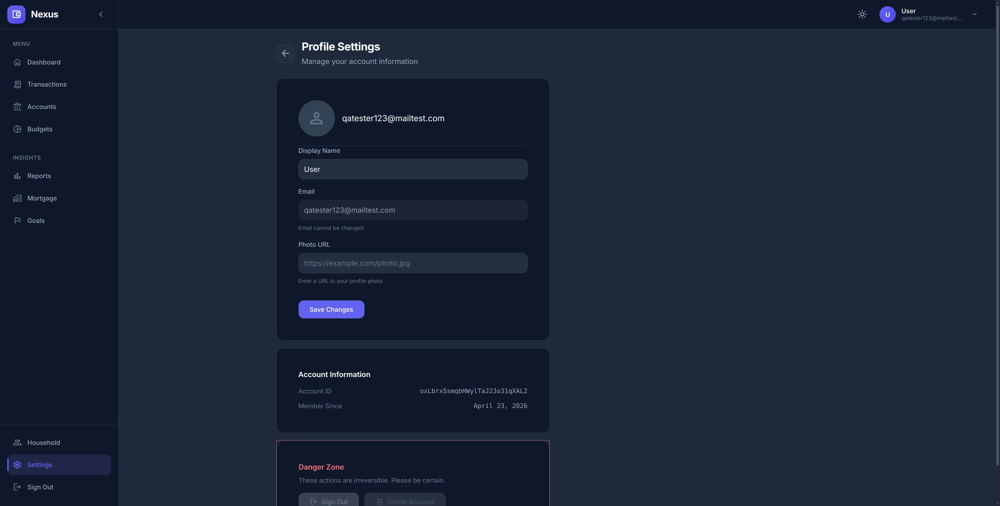

## Step 56: Unknown goal

**URL:** https://nexus-finance-6c6c6.web.app/settings/profile

**Action:** input

**Details:** {'input': {'index': 3312, 'text': 'TD Bank', 'clear': True}, 'interacted_element': DOMInteractedElement(node_id=9842, backend_node_id=3312, frame_id=None, node_type=<NodeType.ELEMENT_NODE: 1>, node_value='', node_name='INPUT', attributes={'_ngcontent-ng-c2610227862': '', 'type': 'text', 'name': 'lender', 'placeholder': 'e.g., TD Bank', 'required': '', 'class': 'ng-untouched ng-pristine ng-invalid'}, bounds=DOMRect(x=1105.1429449717205, y=219.00001740455627, width=272.00002161661786, height=44.57143211364746), x_path='html/body/app-root/app-main-layout/div/div/main/app-mortgage-list/div/div[3]/div/form/div[1]/div[2]/input', element_hash=1574016775415324392, stable_hash=6797226593651099787, ax_name='e.g., TD Bank')}

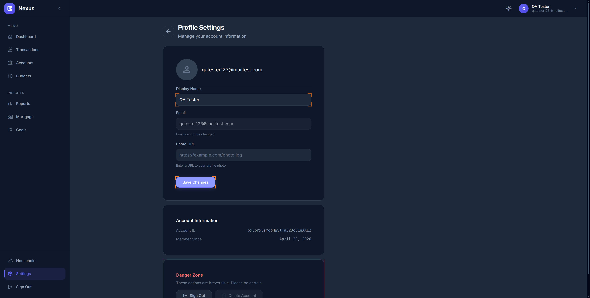

## Step 57: Unknown goal

**URL:** https://nexus-finance-6c6c6.web.app/transactions

**Action:** save_as_pdf

**Details:** {'save_as_pdf': {'file_name': '20_add_mortgage_modal_filled.pdf', 'print_background': True, 'landscape': False, 'scale': 1.0, 'paper_format': 'Letter'}, 'interacted_element': None}

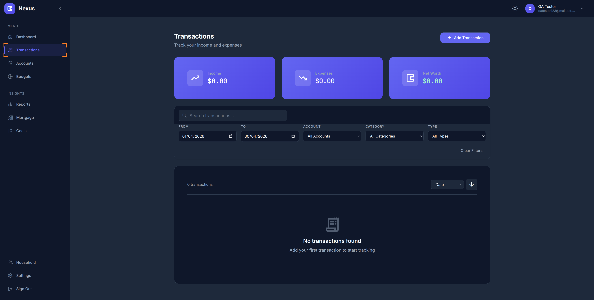

## Step 58: Unknown goal

**URL:** https://nexus-finance-6c6c6.web.app/transactions

**Action:** click

**Details:** {'click': {'index': 3437}, 'interacted_element': DOMInteractedElement(node_id=10574, backend_node_id=3437, frame_id=None, node_type=<NodeType.ELEMENT_NODE: 1>, node_value='', node_name='BUTTON', attributes={'_ngcontent-ng-c2610227862': '', 'type': 'submit', 'class': 'btn btn-primary'}, bounds=DOMRect(x=1249.241170709332, y=947.1429324150085, width=127.9017958790064, height=40.00000317891439), x_path='html/body/app-root/app-main-layout/div/div/main/app-mortgage-list/div/div[3]/div/form/div[9]/button[2]', element_hash=6383615799934662454, stable_hash=6383615799934662454, ax_name='Add Mortgage')}

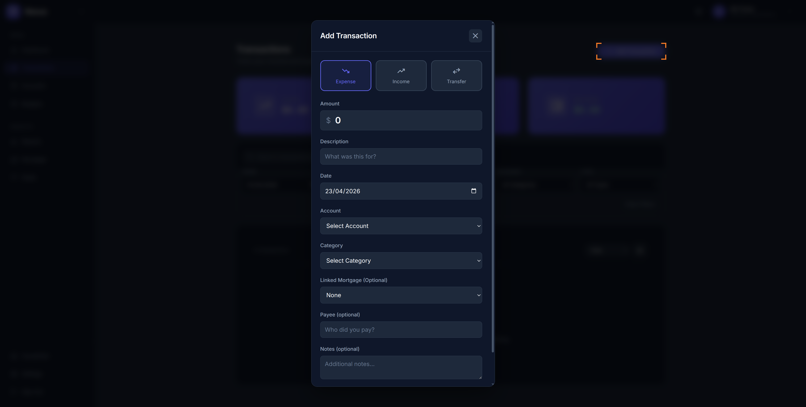

## Step 59: Unknown goal

**URL:** https://nexus-finance-6c6c6.web.app/transactions

**Action:** save_as_pdf

**Details:** {'save_as_pdf': {'file_name': '21_mortgages_with_mortgage.pdf', 'print_background': True, 'landscape': False, 'scale': 1.0, 'paper_format': 'Letter'}, 'interacted_element': None}

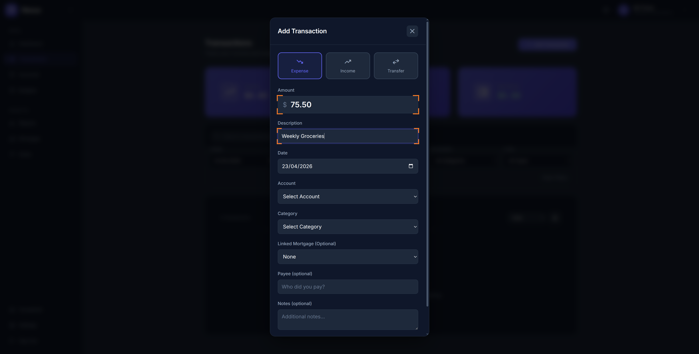

## Step 60: Unknown goal

**URL:** https://nexus-finance-6c6c6.web.app/transactions

**Action:** click

**Details:** {'click': {'index': 570}, 'interacted_element': DOMInteractedElement(node_id=10709, backend_node_id=570, frame_id=None, node_type=<NodeType.ELEMENT_NODE: 1>, node_value='', node_name='A', attributes={'_ngcontent-ng-c1530555886': '', 'routerlinkactive': 'active', 'class': 'nav-item', 'href': 'https://nexus-finance-6c6c6.web.app/goals'}, bounds=DOMRect(x=16.000001271565758, y=462.0000367164612, width=227.4285895029704, height=45.00000357627869), x_path='html/body/app-root/app-main-layout/div/aside/nav/div[2]/a[3]', element_hash=972635573344608832, stable_hash=17113536637840466489, ax_name='flag Goals')}

## Step 61: Unknown goal

**URL:** https://nexus-finance-6c6c6.web.app/transactions

**Action:** save_as_pdf

**Details:** {'save_as_pdf': {'file_name': '22_goals_page.pdf', 'print_background': True, 'landscape': False, 'scale': 1.0, 'paper_format': 'Letter'}, 'interacted_element': None}

## Step 62: Unknown goal

**URL:** https://nexus-finance-6c6c6.web.app/transactions

**Action:** click

**Details:** {'click': {'index': 3828}, 'interacted_element': DOMInteractedElement(node_id=11069, backend_node_id=3828, frame_id=None, node_type=<NodeType.ELEMENT_NODE: 1>, node_value='', node_name='BUTTON', attributes={'_ngcontent-ng-c3983874584': '', 'class': 'btn btn-primary'}, bounds=DOMRect(x=1703.526921098431, y=88.00000699361166, width=139.6160825242599, height=40.00000317891439), x_path='html/body/app-root/app-main-layout/div/div/main/app-goals-list/div/header/button', element_hash=6925777686447792587, stable_hash=6925777686447792587, ax_name='add New Goal')}

## Step 63: Unknown goal

**URL:** https://nexus-finance-6c6c6.web.app/transactions

**Action:** save_as_pdf

**Details:** {'save_as_pdf': {'file_name': '23_new_goal_modal.pdf', 'print_background': True, 'landscape': False, 'scale': 1.0, 'paper_format': 'Letter'}, 'interacted_element': None}

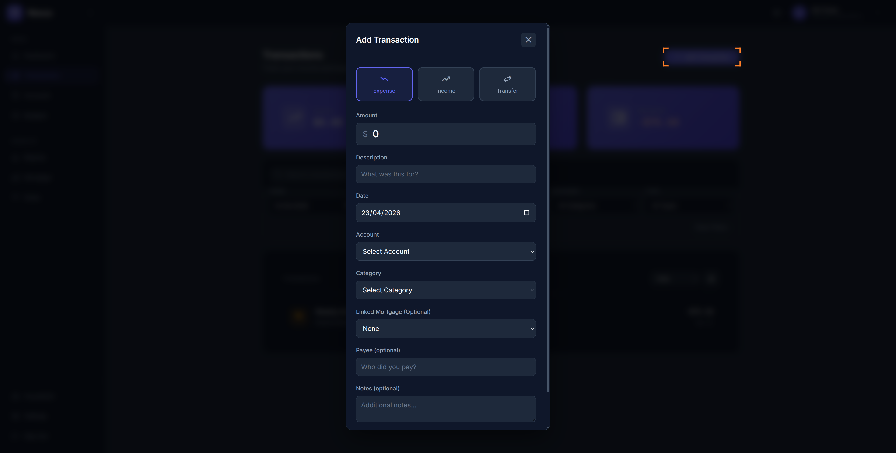

## Step 64: Unknown goal

**URL:** https://nexus-finance-6c6c6.web.app/transactions

**Action:** input

**Details:** {'input': {'index': 3872, 'text': 'Emergency Fund', 'clear': True}, 'interacted_element': DOMInteractedElement(node_id=11296, backend_node_id=3872, frame_id=None, node_type=<NodeType.ELEMENT_NODE: 1>, node_value='', node_name='INPUT', attributes={'_ngcontent-ng-c1852467328': '', 'id': 'name', 'type': 'text', 'formcontrolname': 'name', 'placeholder': 'e.g. Vacation Fund', 'class': 'ng-untouched ng-pristine ng-invalid'}, bounds=DOMRect(x=871.1429263750713, y=339.7857412894567, width=452.0000359217326, height=44.57143211364746), x_path='html/body/app-root/app-main-layout/div/div/main/app-goals-list/div/div[2]/div/app-goal-form/form/div[1]/div[1]/input', element_hash=1094303149222415229, stable_hash=7385209564472064086, ax_name='Goal Name')}

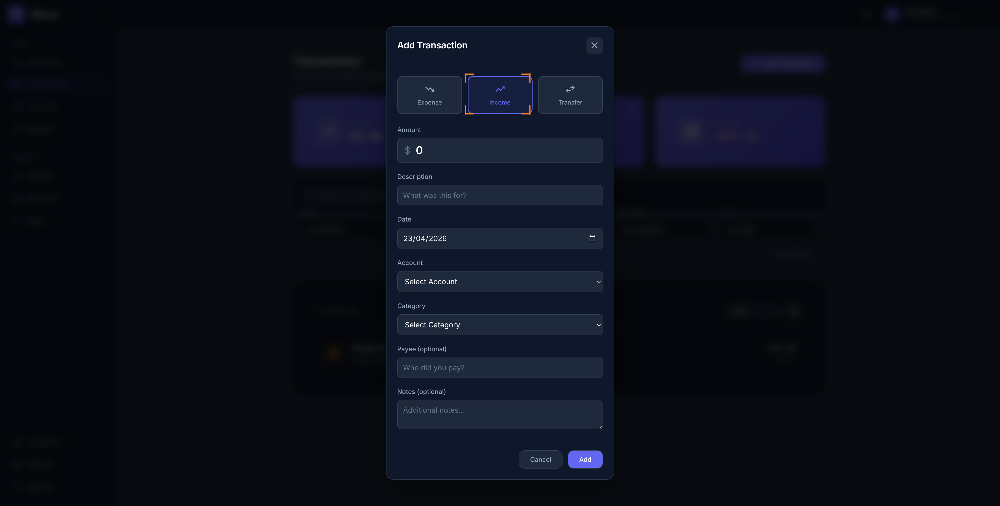

## Step 65: Unknown goal

**URL:** https://nexus-finance-6c6c6.web.app/transactions

**Action:** input

**Details:** {'input': {'index': 3882, 'text': '10000', 'clear': True}, 'interacted_element': DOMInteractedElement(node_id=11308, backend_node_id=3882, frame_id=None, node_type=<NodeType.ELEMENT_NODE: 1>, node_value='', node_name='INPUT', attributes={'_ngcontent-ng-c1852467328': '', 'id': 'targetAmount', 'type': 'number', 'formcontrolname': 'targetAmount', 'placeholder': '0.00', 'class': 'ng-untouched ng-pristine ng-invalid'}, bounds=DOMRect(x=871.1429263750713, y=433.3571772972743, width=452.0000359217326, height=44.57143211364746), x_path='html/body/app-root/app-main-layout/div/div/main/app-goals-list/div/div[2]/div/app-goal-form/form/div[1]/div[2]/div/input', element_hash=1202633995364715834, stable_hash=817773647910173865, ax_name='Target Amount')}

## Step 66: Unknown goal

**URL:** https://nexus-finance-6c6c6.web.app/transactions

**Action:** click

**Details:** {'click': {'index': 3904}, 'interacted_element': DOMInteractedElement(node_id=11753, backend_node_id=3904, frame_id=None, node_type=<NodeType.ELEMENT_NODE: 1>, node_value='', node_name='BUTTON', attributes={'_ngcontent-ng-c1852467328': '', 'type': 'submit', 'class': 'btn btn-primary'}, bounds=DOMRect(x=1196.2947379300992, y=844.6429242690405, width=126.84822436670463, height=40.00000317891439), x_path='html/body/app-root/app-main-layout/div/div/main/app-goals-list/div/div[2]/div/app-goal-form/form/div[2]/button[2]', element_hash=1484975929230454449, stable_hash=17625876993726312106, ax_name='Create Goal')}

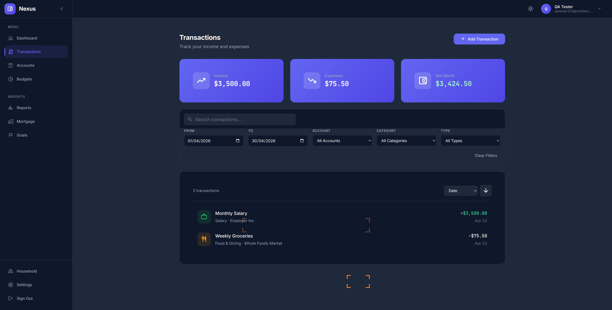

## Step 67: Unknown goal

**URL:** https://nexus-finance-6c6c6.web.app/transactions

**Action:** save_as_pdf

**Details:** {'save_as_pdf': {'file_name': '24_goals_with_goal.pdf', 'print_background': True, 'landscape': False, 'scale': 1.0, 'paper_format': 'Letter'}, 'interacted_element': None}

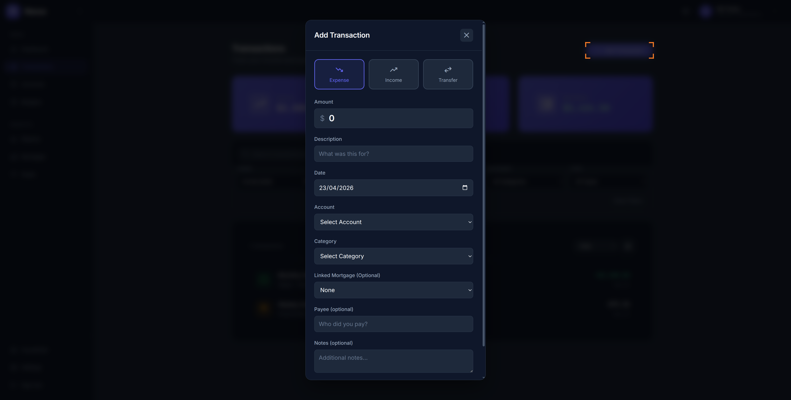

## Step 68: Unknown goal

**URL:** https://nexus-finance-6c6c6.web.app/transactions

**Action:** click

**Details:** {'click': {'index': 4046}, 'interacted_element': DOMInteractedElement(node_id=11981, backend_node_id=4046, frame_id=None, node_type=<NodeType.ELEMENT_NODE: 1>, node_value='', node_name='BUTTON', attributes={'_ngcontent-ng-c2265281000': '', 'class': 'btn-text'}, bounds=DOMRect(x=832.696494748195, y=389.74110240240896, width=140.5357254544894, height=40.00000317891439), x_path='html/body/app-root/app-main-layout/div/div/main/app-goals-list/div/div/app-goal-card/app-card/div/div/div[2]/div[3]/button', element_hash=7155114016402927674, stable_hash=7155114016402927674, ax_name='add Add Money')}

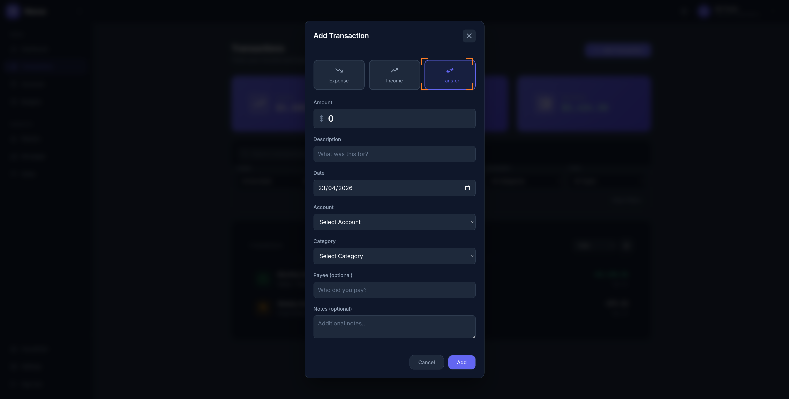

## Step 69: Unknown goal

**URL:** https://nexus-finance-6c6c6.web.app/transactions

**Action:** save_as_pdf

**Details:** {'save_as_pdf': {'file_name': '25_add_money_to_goal_modal.pdf', 'print_background': True, 'landscape': False, 'scale': 1.0, 'paper_format': 'Letter'}, 'interacted_element': None}

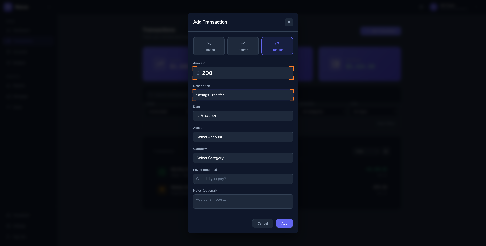

## Step 70: Unknown goal

**URL:** https://nexus-finance-6c6c6.web.app/transactions

**Action:** input

**Details:** {'input': {'index': 4083, 'text': '500', 'clear': True}, 'interacted_element': DOMInteractedElement(node_id=12226, backend_node_id=4083, frame_id=None, node_type=<NodeType.ELEMENT_NODE: 1>, node_value='', node_name='INPUT', attributes={'_ngcontent-ng-c3983874584': '', 'type': 'number', 'name': 'amount', 'placeholder': '0.00', 'min': '0.01', 'step': '0.01', 'class': 'ng-untouched ng-pristine ng-invalid'}, bounds=DOMRect(x=937.14293162028, y=554.5000440677007, width=320.0000254313151, height=44.57143211364746), x_path='html/body/app-root/app-main-layout/div/div/main/app-goals-list/div/div[2]/div/div[2]/div[1]/input', element_hash=579895691848265110, stable_hash=4284569501956776992, ax_name='0.00')}

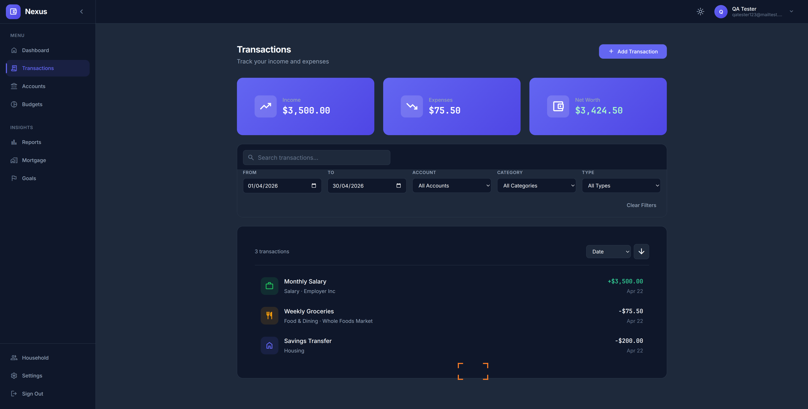

## Step 71: Unknown goal

**URL:** https://nexus-finance-6c6c6.web.app/transactions

**Action:** click

**Details:** {'click': {'index': 4086}, 'interacted_element': DOMInteractedElement(node_id=12488, backend_node_id=4086, frame_id=None, node_type=<NodeType.ELEMENT_NODE: 1>, node_value='', node_name='BUTTON', attributes={'_ngcontent-ng-c3983874584': '', 'class': 'btn btn-primary'}, bounds=DOMRect(x=1180.8661652753751, y=619.0714777708054, width=76.27679177622001, height=40.00000317891439), x_path='html/body/app-root/app-main-layout/div/div/main/app-goals-list/div/div[2]/div/div[2]/div[2]/button[2]', element_hash=5426047310685158354, stable_hash=5426047310685158354, ax_name='Add')}

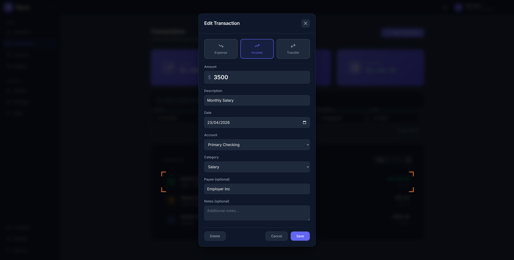

## Step 72: Unknown goal

**URL:** https://nexus-finance-6c6c6.web.app/transactions

**Action:** save_as_pdf

**Details:** {'save_as_pdf': {'file_name': '26_goals_with_500.pdf', 'print_background': True, 'landscape': False, 'scale': 1.0, 'paper_format': 'Letter'}, 'interacted_element': None}

## Step 73: Unknown goal

**URL:** https://nexus-finance-6c6c6.web.app/transactions

**Action:** click

**Details:** {'click': {'index': 4036}, 'interacted_element': DOMInteractedElement(node_id=12689, backend_node_id=4036, frame_id=None, node_type=<NodeType.ELEMENT_NODE: 1>, node_value='', node_name='BUTTON', attributes={'_ngcontent-ng-c2265281000': '', 'class': 'menu-btn'}, bounds=DOMRect(x=925.2232878158491, y=228.16966099043688, width=32.00893111526966, height=34.85714562733968), x_path='html/body/app-root/app-main-layout/div/div/main/app-goals-list/div/div/app-goal-card/app-card/div/div/div[1]/button', element_hash=4783844697608390270, stable_hash=4783844697608390270, ax_name='more_vert')}

## Step 74: Unknown goal

**URL:** https://nexus-finance-6c6c6.web.app/transactions

**Action:** save_as_pdf

**Details:** {'save_as_pdf': {'file_name': '27_goal_context_menu.pdf', 'print_background': True, 'landscape': False, 'scale': 1.0, 'paper_format': 'Letter'}, 'interacted_element': None}

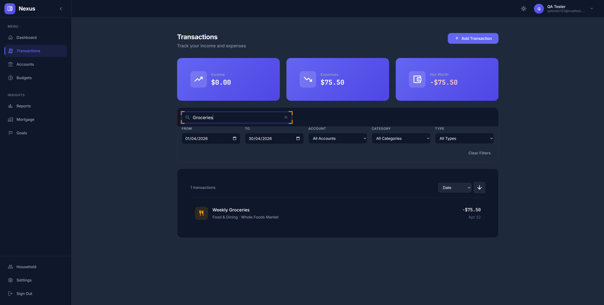

## Step 75: Unknown goal

**URL:** https://nexus-finance-6c6c6.web.app/transactions

**Action:** click

**Details:** {'click': {'index': 4115}, 'interacted_element': DOMInteractedElement(node_id=12941, backend_node_id=4115, frame_id=None, node_type=<NodeType.ELEMENT_NODE: 1>, node_value='', node_name='BUTTON', attributes={'_ngcontent-ng-c3983874584': '', 'aria-label': 'Close menu', 'class': 'close-btn'}, bounds=DOMRect(x=1225.1340259363255, y=483.7143241564433, width=32.00893111526966, height=32.000002543131515), x_path='html/body/app-root/app-main-layout/div/div/main/app-goals-list/div/div[2]/div/div[1]/button', element_hash=8932405513024882901, stable_hash=8932405513024882901, ax_name='Close menu')}

## Step 76: Unknown goal

**URL:** https://nexus-finance-6c6c6.web.app/transactions

**Action:** click

**Details:** {'click': {'index': 523}, 'interacted_element': DOMInteractedElement(node_id=13085, backend_node_id=523, frame_id=None, node_type=<NodeType.ELEMENT_NODE: 1>, node_value='', node_name='A', attributes={'_ngcontent-ng-c1530555886': '', 'routerlink': '/household', 'routerlinkactive': 'active', 'class': 'nav-item', 'href': 'https://nexus-finance-6c6c6.web.app/household'}, bounds=DOMRect(x=16.000001271565758, y=950.0000754992168, width=227.4285895029704, height=45.00000357627869), x_path='html/body/app-root/app-main-layout/div/aside/div[2]/a[1]', element_hash=2837021150683213045, stable_hash=2837021150683213045, ax_name='group Household')}

## Step 77: Unknown goal

**URL:** https://nexus-finance-6c6c6.web.app/transactions

**Action:** save_as_pdf

**Details:** {'save_as_pdf': {'file_name': '28_household_page', 'print_background': True, 'landscape': False, 'scale': 1.0, 'paper_format': 'Letter'}, 'interacted_element': None}

## Step 78: Unknown goal

**URL:** https://nexus-finance-6c6c6.web.app/transactions

**Action:** click

**Details:** {'click': {'index': 4152}, 'interacted_element': DOMInteractedElement(node_id=13364, backend_node_id=4152, frame_id=None, node_type=<NodeType.ELEMENT_NODE: 1>, node_value='', node_name='BUTTON', attributes={'_ngcontent-ng-c3483844261': '', 'class': 'btn btn-primary'}, bounds=DOMRect(x=1672.080490027865, y=97.79465062916279, width=171.06251359482607, height=40.00000317891439), x_path='html/body/app-root/app-main-layout/div/div/main/app-household-overview/div/header/button', element_hash=4284667497005894867, stable_hash=4284667497005894867, ax_name='person_add Invite Member')}

## Step 79: Unknown goal

**URL:** https://nexus-finance-6c6c6.web.app/reports

**Action:** save_as_pdf

**Details:** {'save_as_pdf': {'file_name': '29_invite_member_modal.pdf', 'print_background': True, 'landscape': False, 'scale': 1.0, 'paper_format': 'Letter'}, 'interacted_element': None}

## Step 80: Unknown goal

**URL:** https://nexus-finance-6c6c6.web.app/reports

**Action:** click

**Details:** {'click': {'index': 4247}, 'interacted_element': DOMInteractedElement(node_id=14004, backend_node_id=4247, frame_id=None, node_type=<NodeType.ELEMENT_NODE: 1>, node_value='', node_name='BUTTON', attributes={'_ngcontent-ng-c3483844261': '', 'class': 'btn btn-primary full-width'}, bounds=DOMRect(x=897.1429284413656, y=704.4375559836626, width=400.0000317891439, height=40.00000317891439), x_path='html/body/app-root/app-main-layout/div/div/main/app-household-overview/div/div/div/div[2]/button', element_hash=4558446646390355616, stable_hash=4558446646390355616, ax_name='Generate Invite Link')}

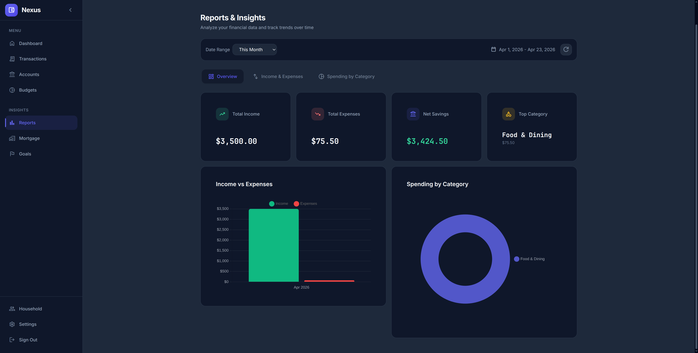

## Step 81: Unknown goal

**URL:** https://nexus-finance-6c6c6.web.app/reports

**Action:** save_as_pdf

**Details:** {'save_as_pdf': {'file_name': '30_invite_code_generated.pdf', 'print_background': True, 'landscape': False, 'scale': 1.0, 'paper_format': 'Letter'}, 'interacted_element': None}

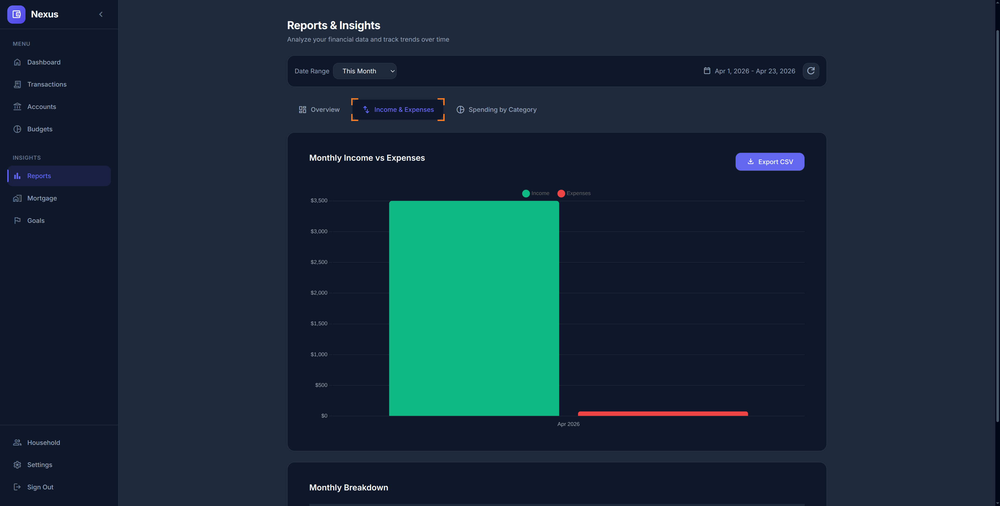

## Step 82: Unknown goal

**URL:** https://nexus-finance-6c6c6.web.app/reports

**Action:** click

**Details:** {'click': {'index': 4240}, 'interacted_element': DOMInteractedElement(node_id=14257, backend_node_id=4240, frame_id=None, node_type=<NodeType.ELEMENT_NODE: 1>, node_value='', node_name='BUTTON', attributes={'_ngcontent-ng-c3483844261': '', 'class': 'close-btn'}, bounds=DOMRect(x=1265.142957687378, y=409.4911039719979, width=32.000002543131515, height=32.000002543131515), x_path='html/body/app-root/app-main-layout/div/div/main/app-household-overview/div/div/div/div[1]/button', element_hash=6844745489714136805, stable_hash=6844745489714136805, ax_name='close')}

## Step 83: Unknown goal

**URL:** https://nexus-finance-6c6c6.web.app/reports

**Action:** save_as_pdf

**Details:** {'save_as_pdf': {'file_name': '31_household_page_final.pdf', 'print_background': True, 'landscape': False, 'scale': 1.0, 'paper_format': 'Letter'}, 'interacted_element': None}

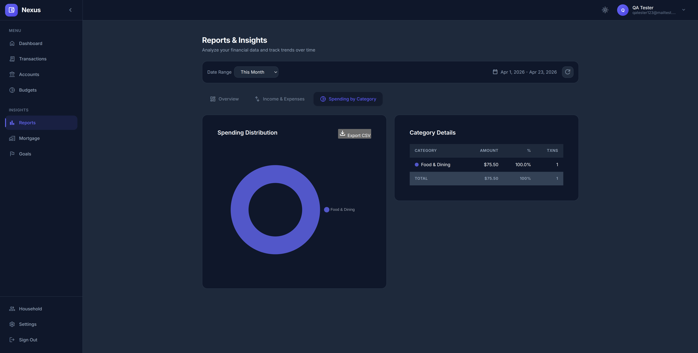

## Step 84: Unknown goal

**URL:** https://nexus-finance-6c6c6.web.app/auth/login

**Action:** click

**Details:** {'click': {'index': 526}, 'interacted_element': DOMInteractedElement(node_id=14413, backend_node_id=526, frame_id=None, node_type=<NodeType.ELEMENT_NODE: 1>, node_value='', node_name='A', attributes={'_ngcontent-ng-c1530555886': '', 'routerlink': '/settings', 'routerlinkactive': 'active', 'class': 'nav-item', 'href': 'https://nexus-finance-6c6c6.web.app/settings'}, bounds=DOMRect(x=16.000001271565758, y=999.0000793933868, width=227.4285895029704, height=45.00000357627869), x_path='html/body/app-root/app-main-layout/div/aside/div[2]/a[2]', element_hash=3369659759270346705, stable_hash=3369659759270346705, ax_name='settings Settings')}

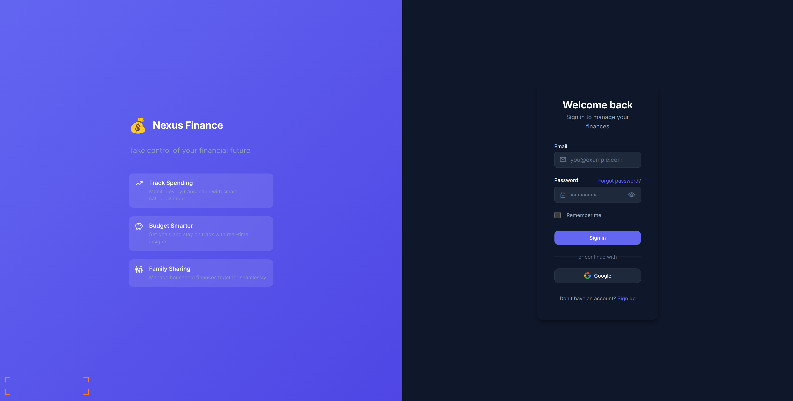

## Step 85: Unknown goal

**URL:** https://nexus-finance-6c6c6.web.app/auth/forgot-password

**Action:** save_as_pdf

**Details:** {'save_as_pdf': {'file_name': '32_settings_preferences.pdf', 'print_background': True, 'landscape': False, 'scale': 1.0, 'paper_format': 'Letter'}, 'interacted_element': None}

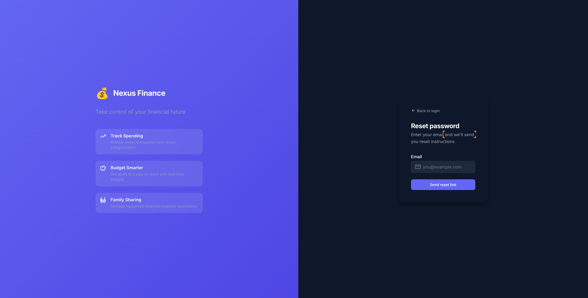

## Step 86: Unknown goal

**URL:** https://nexus-finance-6c6c6.web.app/auth/forgot-password

**Action:** click

**Details:** {'click': {'index': 4325}, 'interacted_element': DOMInteractedElement(node_id=14715, backend_node_id=4325, frame_id=None, node_type=<NodeType.ELEMENT_NODE: 1>, node_value='', node_name='BUTTON', attributes={'_ngcontent-ng-c2536939705': '', 'class': 'tab'}, bounds=DOMRect(x=751.2678571428571, y=171.59821428571428, width=129.52678571428572, height=44.0), x_path='html/body/app-root/app-main-layout/div/div/main/app-settings/div/div[1]/button[2]', element_hash=677259222040177727, stable_hash=677259222040177727, ax_name='category Categories')}

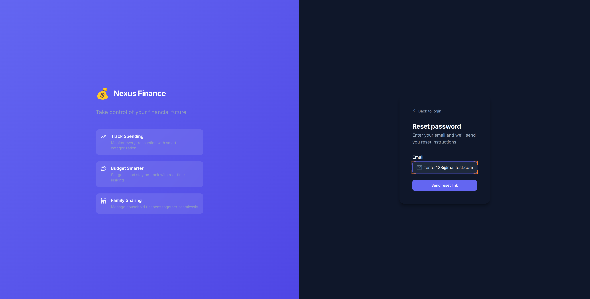

## Step 87: Unknown goal

**URL:** https://nexus-finance-6c6c6.web.app/auth/forgot-password

**Action:** save_as_pdf

**Details:** {'save_as_pdf': {'file_name': '33_settings_categories', 'print_background': True, 'landscape': False, 'scale': 1.0, 'paper_format': 'Letter'}, 'interacted_element': None}

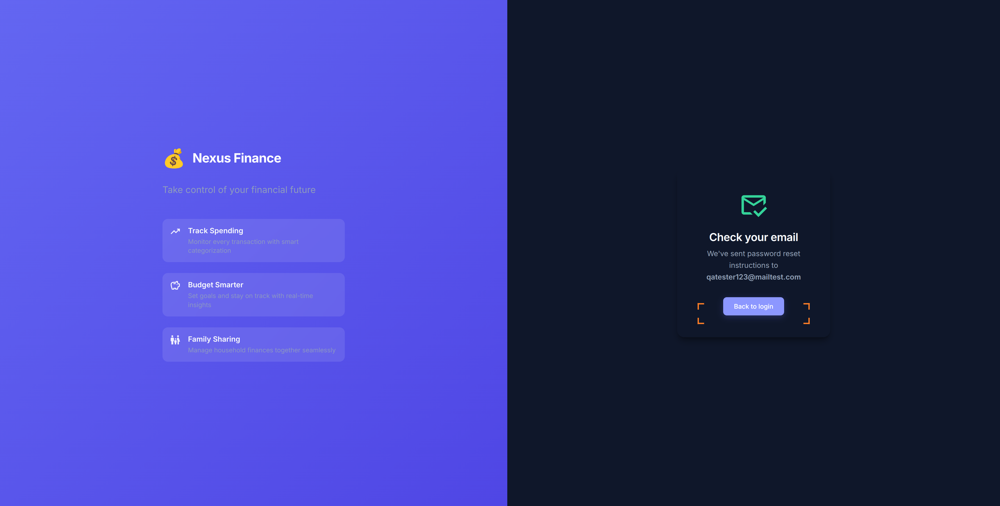

## Step 88: Unknown goal

**URL:** https://nexus-finance-6c6c6.web.app/auth/login

**Action:** click

**Details:** {'click': {'index': 4475}, 'interacted_element': DOMInteractedElement(node_id=15040, backend_node_id=4475, frame_id=None, node_type=<NodeType.ELEMENT_NODE: 1>, node_value='', node_name='BUTTON', attributes={'_ngcontent-ng-c2536939705': '', 'class': 'btn btn-primary'}, bounds=DOMRect(x=1675.2412045647702, y=248.16966257989407, width=167.90179905792078, height=40.00000317891439), x_path='html/body/app-root/app-main-layout/div/div/main/app-settings/div/div[2]/div/div[1]/button', element_hash=7400868669543618797, stable_hash=7400868669543618797, ax_name='add Add Category')}

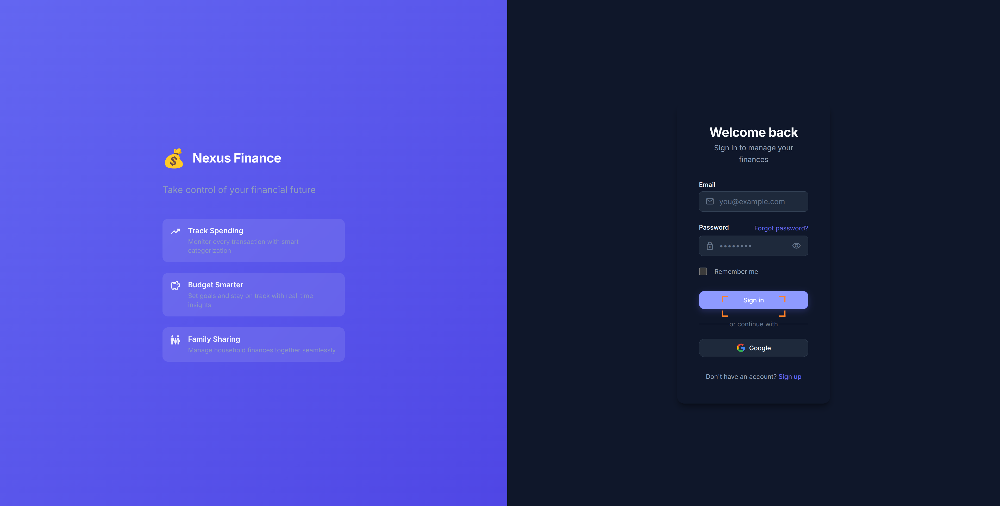

## Step 89: Unknown goal

**URL:** https://nexus-finance-6c6c6.web.app/dashboard

**Action:** save_as_pdf

**Details:** {'save_as_pdf': {'file_name': '34_add_category_modal', 'print_background': True, 'landscape': False, 'scale': 1.0, 'paper_format': 'Letter'}, 'interacted_element': None}

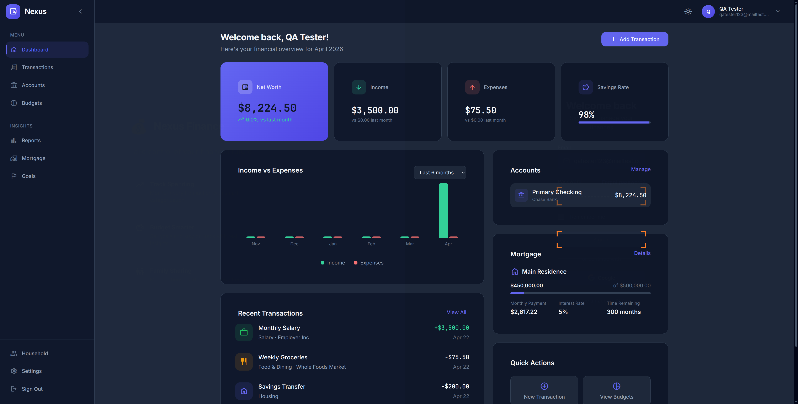

## Step 90: Unknown goal

**URL:** https://nexus-finance-6c6c6.web.app/dashboard

**Action:** input

**Details:** {'input': {'index': 4697, 'text': 'Fitness', 'clear': True}, 'interacted_element': DOMInteractedElement(node_id=15663, backend_node_id=4697, frame_id=None, node_type=<NodeType.ELEMENT_NODE: 1>, node_value='', node_name='INPUT', attributes={'_ngcontent-ng-c2536939705': '', 'type': 'text', 'name': 'name', 'placeholder': 'Category name', 'required': '', 'class': 'ng-untouched ng-pristine ng-invalid'}, bounds=DOMRect(x=877.1429268519084, y=351.8571708202362, width=440.0000349680583, height=44.57143211364746), x_path='html/body/app-root/app-main-layout/div/div/main/app-settings/div/div[3]/div/form/div[1]/input', element_hash=1500389363139733921, stable_hash=13100312182914555672, ax_name='Category name')}

## Step 91: Unknown goal

**URL:** https://nexus-finance-6c6c6.web.app/accounts

**Action:** click

**Details:** {'click': {'index': 4760}, 'interacted_element': DOMInteractedElement(node_id=16326, backend_node_id=4760, frame_id=None, node_type=<NodeType.ELEMENT_NODE: 1>, node_value='', node_name='BUTTON', attributes={'_ngcontent-ng-c2536939705': '', 'type': 'button', 'class': 'icon-btn'}, bounds=DOMRect(x=921.5357875227928, y=639.0000507831573, width=36.00000286102295, height=36.00000286102295), x_path='html/body/app-root/app-main-layout/div/div/main/app-settings/div/div[3]/div/form/div[3]/div/button[22]', element_hash=703212443012563409, stable_hash=16844113507508421066, ax_name='fitness_center')}

## Step 92: Unknown goal

**URL:** https://nexus-finance-6c6c6.web.app/accounts

**Action:** click

**Details:** {'click': {'index': 4715}, 'interacted_element': DOMInteractedElement(node_id=16396, backend_node_id=4715, frame_id=None, node_type=<NodeType.ELEMENT_NODE: 1>, node_value='', node_name='BUTTON', attributes={'_ngcontent-ng-c2536939705': '', 'type': 'submit', 'class': 'btn btn-primary'}, bounds=DOMRect(x=1175.2500934004784, y=824.571494102478, width=141.89286841948828, height=40.00000317891439), x_path='html/body/app-root/app-main-layout/div/div/main/app-settings/div/div[3]/div/form/div[5]/button[2]', element_hash=3590402557813710813, stable_hash=3590402557813710813, ax_name='Add Category')}

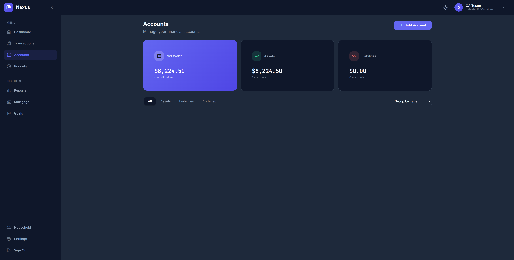

## Step 93: Unknown goal

**URL:** https://nexus-finance-6c6c6.web.app/accounts

**Action:** save_as_pdf

**Details:** {'save_as_pdf': {'file_name': '35_settings_categories_with_custom.pdf', 'print_background': True, 'landscape': False, 'scale': 1.0, 'paper_format': 'Letter'}, 'interacted_element': None}

## Step 94: Unknown goal

**URL:** https://nexus-finance-6c6c6.web.app/accounts

**Action:** click

**Details:** {'click': {'index': 4327}, 'interacted_element': DOMInteractedElement(node_id=16582, backend_node_id=4327, frame_id=None, node_type=<NodeType.ELEMENT_NODE: 1>, node_value='', node_name='BUTTON', attributes={'_ngcontent-ng-c2536939705': '', 'class': 'tab'}, bounds=DOMRect(x=893.9375710437696, y=171.5982279231151, width=141.02679692208767, height=44.00000349680583), x_path='html/body/app-root/app-main-layout/div/div/main/app-settings/div/div[1]/button[3]', element_hash=2376168237695778078, stable_hash=2376168237695778078, ax_name='notifications Notifications')}

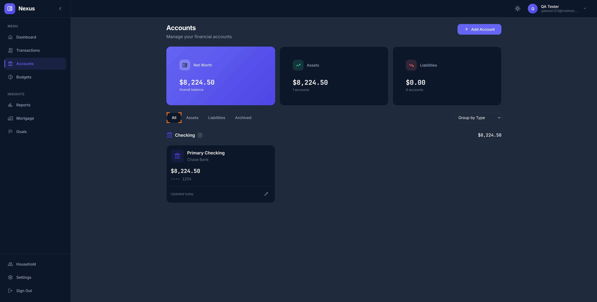

## Step 95: Unknown goal

**URL:** https://nexus-finance-6c6c6.web.app/accounts/uks5VkJaKBTZUV4Up9rY/edit

**Action:** save_as_pdf

**Details:** {'save_as_pdf': {'file_name': '36_settings_notifications', 'print_background': True, 'landscape': False, 'scale': 1.0, 'paper_format': 'Letter'}, 'interacted_element': None}

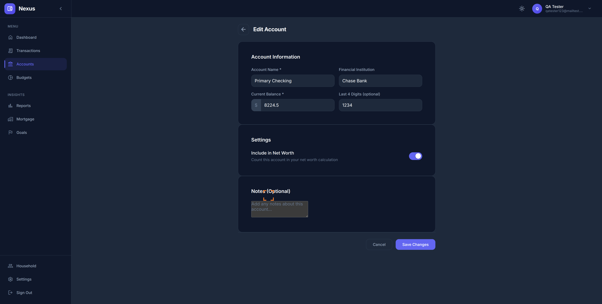

## Step 96: Unknown goal

**URL:** https://nexus-finance-6c6c6.web.app/accounts/uks5VkJaKBTZUV4Up9rY/edit

**Action:** click

**Details:** {'click': {'index': 4323}, 'interacted_element': DOMInteractedElement(node_id=16992, backend_node_id=4323, frame_id=None, node_type=<NodeType.ELEMENT_NODE: 1>, node_value='', node_name='BUTTON', attributes={'_ngcontent-ng-c2536939705': '', 'class': 'tab'}, bounds=DOMRect(x=611.1429057121277, y=171.5982279231151, width=137.2678680519263, height=44.00000349680583), x_path='html/body/app-root/app-main-layout/div/div/main/app-settings/div/div[1]/button[1]', element_hash=1786315385021425974, stable_hash=17927216449517283631, ax_name='tune Preferences')}

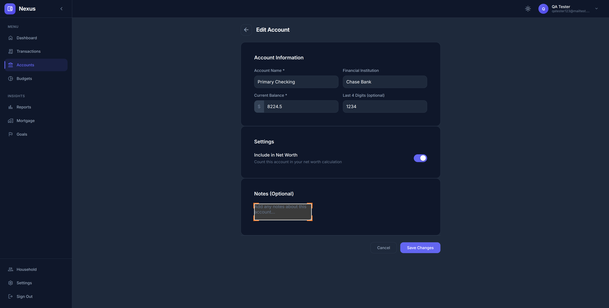

## Step 97: Unknown goal

**URL:** https://nexus-finance-6c6c6.web.app/accounts/uks5VkJaKBTZUV4Up9rY

**Action:** save_as_pdf

**Details:** {'save_as_pdf': {'file_name': '37_settings_preferences_tab', 'print_background': True, 'landscape': False, 'scale': 1.0, 'paper_format': 'Letter'}, 'interacted_element': None}

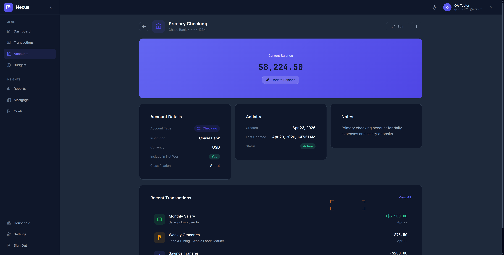

## Step 98: Unknown goal

**URL:** https://nexus-finance-6c6c6.web.app/accounts/uks5VkJaKBTZUV4Up9rY

**Action:** click

**Details:** {'click': {'index': 4998}, 'interacted_element': DOMInteractedElement(node_id=17361, backend_node_id=4998, frame_id=None, node_type=<NodeType.ELEMENT_NODE: 1>, node_value='', node_name='DIV', attributes={'_ngcontent-ng-c1157209538': '', 'class': 'card'}, bounds=DOMRect(x=606.0, y=951.3482142857143, width=1232.0, height=155.53571428571428), x_path='html/body/app-root/app-main-layout/div/div/main/app-settings/div/div[2]/div/app-card[4]/div', element_hash=458029501740559653, stable_hash=9681401538595335457, ax_name=None)}

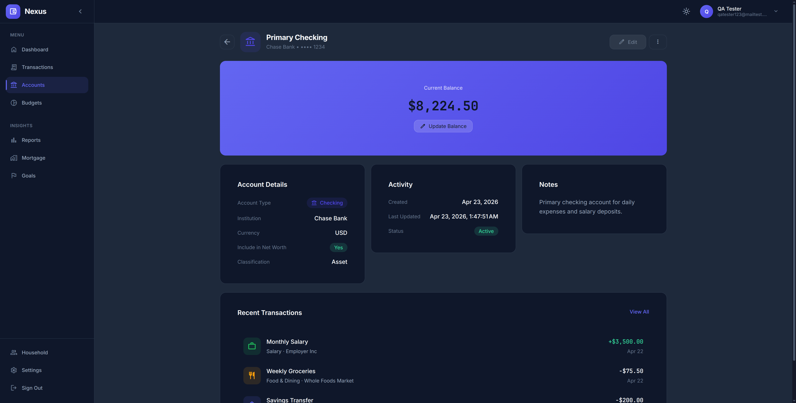

## Step 99: Unknown goal

**URL:** https://nexus-finance-6c6c6.web.app/accounts/uks5VkJaKBTZUV4Up9rY

**Action:** save_as_pdf

**Details:** {'save_as_pdf': {'file_name': '38_profile_settings.pdf', 'print_background': True, 'landscape': False, 'scale': 1.0, 'paper_format': 'Letter'}, 'interacted_element': None}

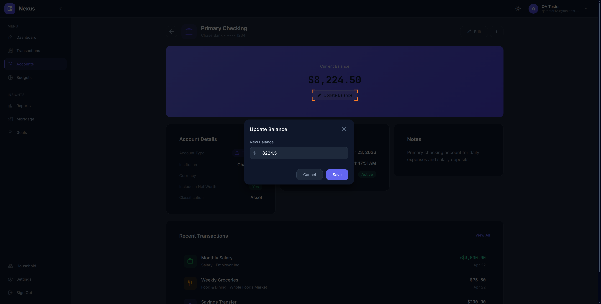

## Step 100: Unknown goal

**URL:** https://nexus-finance-6c6c6.web.app/accounts/uks5VkJaKBTZUV4Up9rY

**Action:** input

**Details:** {'input': {'index': 5108, 'text': 'QA Tester', 'clear': True}, 'interacted_element': DOMInteractedElement(node_id=17850, backend_node_id=5108, frame_id=None, node_type=<NodeType.ELEMENT_NODE: 1>, node_value='', node_name='INPUT', attributes={'_ngcontent-ng-c2265281790': '', 'type': 'text', 'name': 'displayName', 'placeholder': 'Your name', 'class': 'ng-untouched ng-pristine ng-valid'}, bounds=DOMRect(x=654.5714285714286, y=349.74107142857144, width=502.85714285714283, height=44.57142857142857), x_path='html/body/app-root/app-main-layout/div/div/main/app-profile/div/div/app-card[1]/div/div/form/div[1]/input', element_hash=433179047035032608, stable_hash=9485452577757568049, ax_name='Your name')}

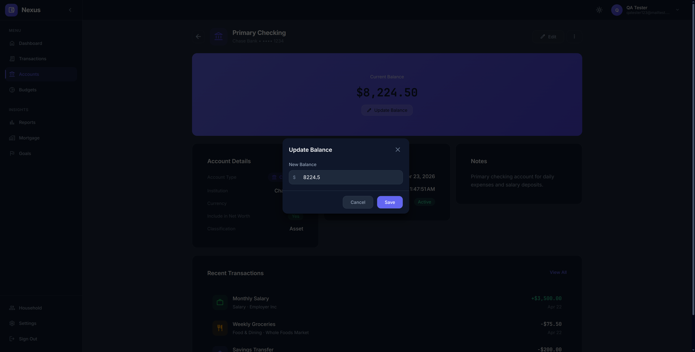

## Step 101: Unknown goal

**URL:** https://nexus-finance-6c6c6.web.app/accounts/uks5VkJaKBTZUV4Up9rY

**Action:** click

**Details:** {'click': {'index': 5121}, 'interacted_element': DOMInteractedElement(node_id=17876, backend_node_id=5121, frame_id=None, node_type=<NodeType.ELEMENT_NODE: 1>, node_value='', node_name='BUTTON', attributes={'_ngcontent-ng-c2265281790': '', 'type': 'submit', 'class': 'btn btn-primary'}, bounds=DOMRect(x=654.5714285714286, y=659.8482142857143, width=145.16071428571428, height=40.0), x_path='html/body/app-root/app-main-layout/div/div/main/app-profile/div/div/app-card[1]/div/div/form/div[4]/button', element_hash=2348473247968164812, stable_hash=2348473247968164812, ax_name='Save Changes')}

## Step 102: Unknown goal

**URL:** https://nexus-finance-6c6c6.web.app/accounts/uks5VkJaKBTZUV4Up9rY

**Action:** save_as_pdf

**Details:** {'save_as_pdf': {'file_name': '39_profile_settings_updated.pdf', 'print_background': True, 'landscape': False, 'scale': 1.0, 'paper_format': 'Letter'}, 'interacted_element': None}

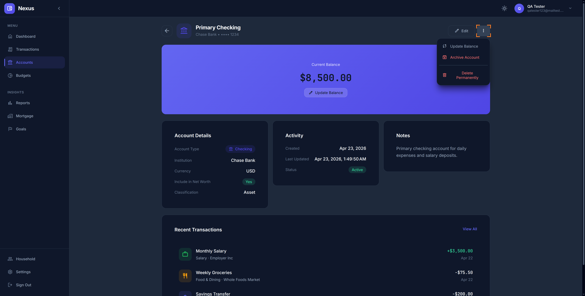

## Step 103: Unknown goal

**URL:** https://nexus-finance-6c6c6.web.app/budgets

**Action:** click

**Details:** {'click': {'index': 555}, 'interacted_element': DOMInteractedElement(node_id=18007, backend_node_id=555, frame_id=None, node_type=<NodeType.ELEMENT_NODE: 1>, node_value='', node_name='A', attributes={'_ngcontent-ng-c1530555886': '', 'routerlinkactive': 'active', 'class': 'nav-item', 'href': 'https://nexus-finance-6c6c6.web.app/transactions'}, bounds=DOMRect(x=16.0, y=163.0, width=227.42857142857142, height=45.0), x_path='html/body/app-root/app-main-layout/div/aside/nav/div[1]/a[2]', element_hash=7427551189070062567, stable_hash=7427551189070062567, ax_name='receipt_long Transactions')}

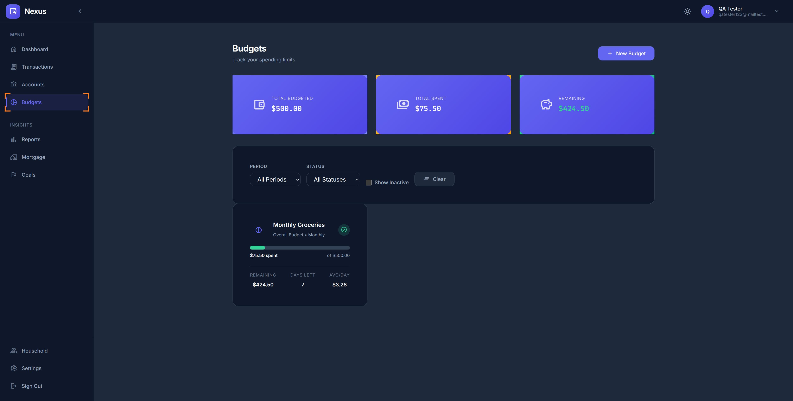

## Step 104: Unknown goal

**URL:** https://nexus-finance-6c6c6.web.app/budgets

**Action:** click

**Details:** {'click': {'index': 5360}, 'interacted_element': DOMInteractedElement(node_id=18371, backend_node_id=5360, frame_id=None, node_type=<NodeType.ELEMENT_NODE: 1>, node_value='', node_name='BUTTON', attributes={'_ngcontent-ng-c3928296004': '', 'class': 'btn btn-primary'}, bounds=DOMRect(x=1626.3215578198433, y=120.00000953674316, width=184.82144325971603, height=40.00000317891439), x_path='html/body/app-root/app-main-layout/div/div/main/app-transaction-list/div/header/button', element_hash=1104866004922658679, stable_hash=10328238041777434483, ax_name='add Add Transaction')}

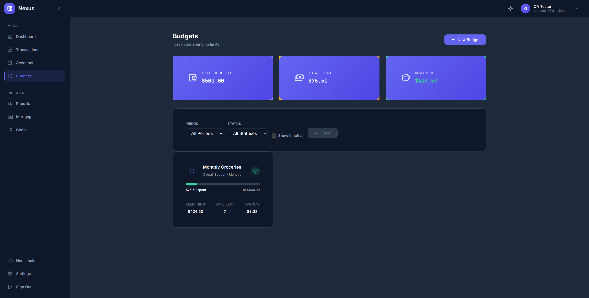

## Step 105: Unknown goal

**URL:** https://nexus-finance-6c6c6.web.app/budgets

**Action:** save_as_pdf

**Details:** {'save_as_pdf': {'file_name': '40_add_transaction_modal_expense', 'print_background': True, 'landscape': False, 'scale': 1.0, 'paper_format': 'Letter'}, 'interacted_element': None}

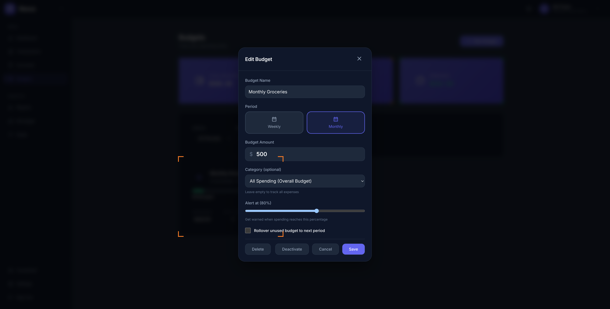

## Step 106: Unknown goal

**URL:** https://nexus-finance-6c6c6.web.app/budgets

**Action:** input

**Details:** {'input': {'index': 5684, 'text': '75.50', 'clear': True}, 'interacted_element': DOMInteractedElement(node_id=19328, backend_node_id=5684, frame_id=None, node_type=<NodeType.ELEMENT_NODE: 1>, node_value='', node_name='INPUT', attributes={'_ngcontent-ng-c3928296004': '', 'type': 'number', 'name': 'amount', 'step': '0.01', 'placeholder': '0.00', 'required': '', 'class': 'ng-untouched ng-pristine ng-valid'}, bounds=DOMRect(x=871.7143549919128, y=301.74109540879726, width=440.5714635848999, height=54.285718599955246), x_path='html/body/app-root/app-main-layout/div/div/main/app-transaction-list/div/div[3]/div/form/div[2]/div/input', element_hash=176229503453963786, stable_hash=14520138965206277586, ax_name='0.00')}

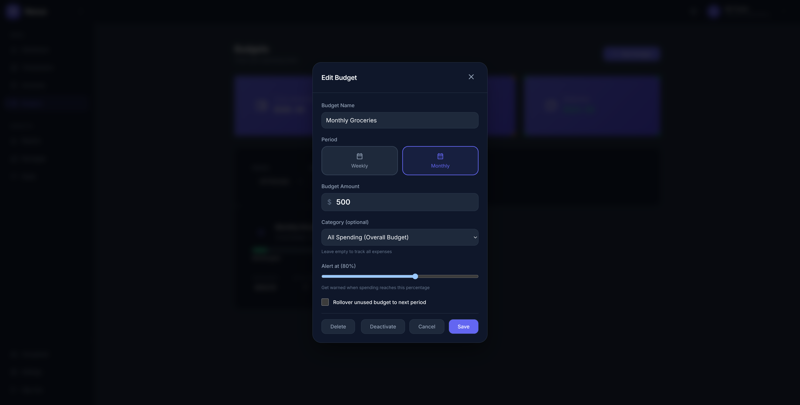

## Step 107: Unknown goal

**URL:** https://nexus-finance-6c6c6.web.app/budgets

**Action:** input

**Details:** {'input': {'index': 5687, 'text': 'Weekly Groceries', 'clear': True}, 'interacted_element': DOMInteractedElement(node_id=19340, backend_node_id=5687, frame_id=None, node_type=<NodeType.ELEMENT_NODE: 1>, node_value='', node_name='INPUT', attributes={'_ngcontent-ng-c3928296004': '', 'type': 'text', 'name': 'description', 'placeholder': 'What was this for?', 'required': '', 'class': 'ng-untouched ng-pristine ng-invalid'}, bounds=DOMRect(x=871.7143549919128, y=405.02681790292263, width=440.5714635848999, height=44.57143211364746), x_path='html/body/app-root/app-main-layout/div/div/main/app-transaction-list/div/div[3]/div/form/div[3]/input', element_hash=937773794508005480, stable_hash=7408376340688513213, ax_name='What was this for?')}

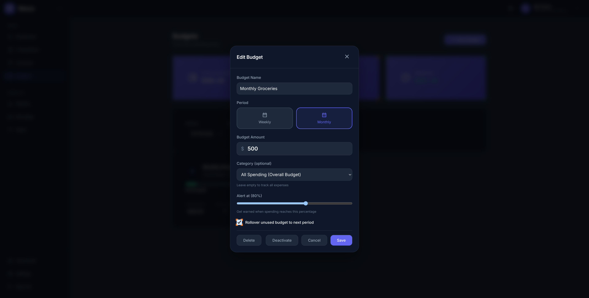

## Step 108: Unknown goal

**URL:** https://nexus-finance-6c6c6.web.app/budgets

**Action:** select_dropdown

**Details:** {'select_dropdown': {'index': 5708, 'text': 'Primary Checking'}, 'interacted_element': DOMInteractedElement(node_id=20171, backend_node_id=5708, frame_id=None, node_type=<NodeType.ELEMENT_NODE: 1>, node_value='', node_name='SELECT', attributes={'_ngcontent-ng-c3928296004': '', 'name': 'accountId', 'required': '', 'class': 'ng-untouched ng-pristine ng-invalid'}, bounds=DOMRect(x=871.7143549919128, y=594.1696900775036, width=440.5714635848999, height=45.714289347330734), x_path='html/body/app-root/app-main-layout/div/div/main/app-transaction-list/div/div[3]/div/form/div[5]/select', element_hash=5997806183700159264, stable_hash=12327630401633471267, ax_name=None)}

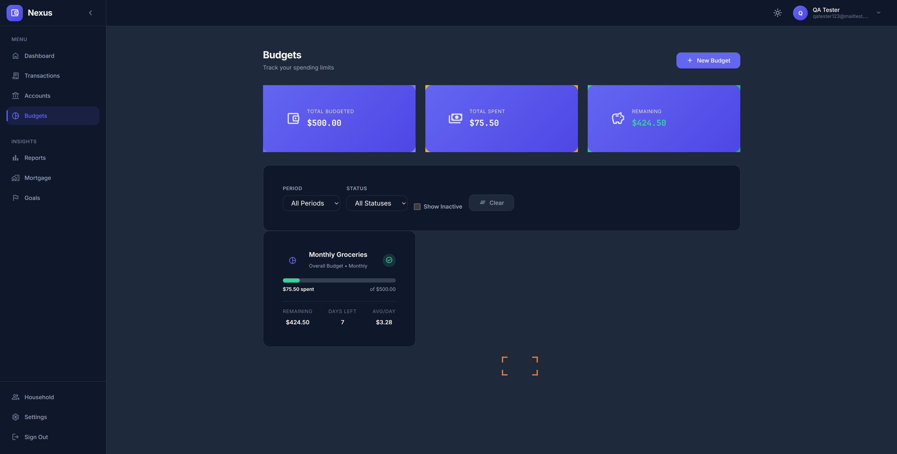

## Step 109: Unknown goal

**URL:** https://nexus-finance-6c6c6.web.app/budgets

**Action:** select_dropdown

**Details:** {'select_dropdown': {'index': 5720, 'text': 'Food & Dining'}, 'interacted_element': DOMInteractedElement(node_id=20196, backend_node_id=5720, frame_id=None, node_type=<NodeType.ELEMENT_NODE: 1>, node_value='', node_name='SELECT', attributes={'_ngcontent-ng-c3928296004': '', 'name': 'categoryId', 'class': 'ng-untouched ng-pristine ng-valid'}, bounds=DOMRect(x=871.7143549919128, y=688.8839833190044, width=440.5714635848999, height=45.714289347330734), x_path='html/body/app-root/app-main-layout/div/div/main/app-transaction-list/div/div[3]/div/form/div[6]/select', element_hash=1761915909301262284, stable_hash=7519768860028464379, ax_name=None)}

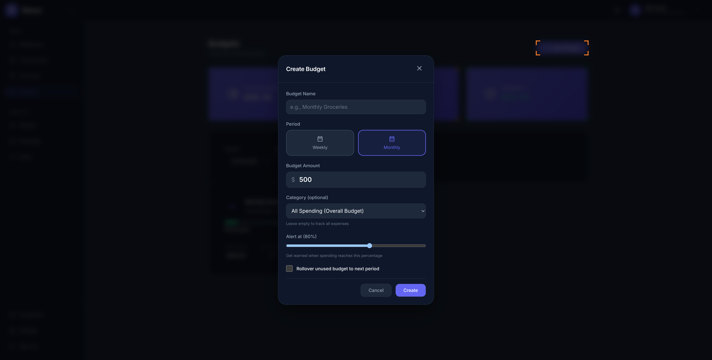

## Step 110: Unknown goal

**URL:** https://nexus-finance-6c6c6.web.app/budgets

**Action:** input

**Details:** {'input': {'index': 5726, 'text': 'Whole Foods Market', 'clear': True}, 'interacted_element': DOMInteractedElement(node_id=21136, backend_node_id=5726, frame_id=None, node_type=<NodeType.ELEMENT_NODE: 1>, node_value='', node_name='INPUT', attributes={'_ngcontent-ng-c3928296004': '', 'type': 'text', 'name': 'payee', 'placeholder': 'Who did you pay?', 'class': 'ng-untouched ng-pristine ng-valid'}, bounds=DOMRect(x=871.7143549919128, y=878.3125698020061, width=440.5714635848999, height=44.57143211364746), x_path='html/body/app-root/app-main-layout/div/div/main/app-transaction-list/div/div[3]/div/form/div[8]/input', element_hash=146214768672057247, stable_hash=12908104273127944949, ax_name='Who did you pay?')}

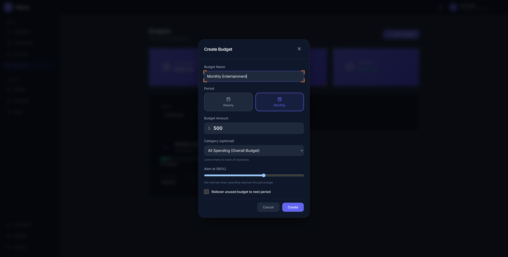

## Step 111: Unknown goal

**URL:** https://nexus-finance-6c6c6.web.app/budgets

**Action:** input

**Details:** {'input': {'index': 5731, 'text': 'Weekly grocery shopping trip', 'clear': True}, 'interacted_element': DOMInteractedElement(node_id=21144, backend_node_id=5731, frame_id=None, node_type=<NodeType.ELEMENT_NODE: 1>, node_value='', node_name='TEXTAREA', attributes={'_ngcontent-ng-c3928296004': '', 'name': 'notes', 'rows': '2', 'placeholder': 'Additional notes...', 'class': 'ng-untouched ng-pristine ng-valid'}, bounds=DOMRect(x=871.7143549919128, y=971.8840058098237, width=440.5714635848999, height=64.00000508626303), x_path='html/body/app-root/app-main-layout/div/div/main/app-transaction-list/div/div[3]/div/form/div[9]/textarea', element_hash=185210120503584357, stable_hash=16781405269695630683, ax_name='Additional notes...')}

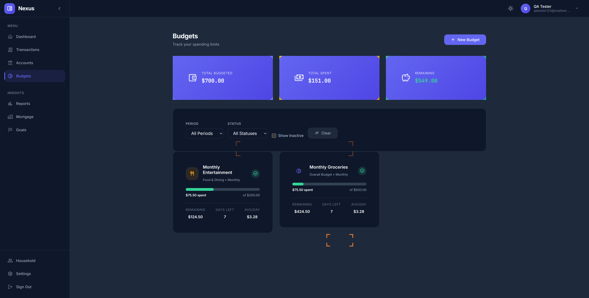

## Step 112: Unknown goal

**URL:** https://nexus-finance-6c6c6.web.app/mortgage

**Action:** click

**Details:** {'click': {'index': 5795}, 'interacted_element': DOMInteractedElement(node_id=21153, backend_node_id=5795, frame_id=None, node_type=<NodeType.ELEMENT_NODE: 1>, node_value='', node_name='BUTTON', attributes={'_ngcontent-ng-c3928296004': '', 'type': 'submit', 'class': 'btn btn-primary'}, bounds=DOMRect(x=1236.009026800593, y=1082.7411574771008, width=76.27679177622001, height=40.00000317891439), x_path='html/body/app-root/app-main-layout/div/div/main/app-transaction-list/div/div[3]/div/form/div[10]/button[2]', element_hash=917958115495056561, stable_hash=17058859179990914218, ax_name='Add')}

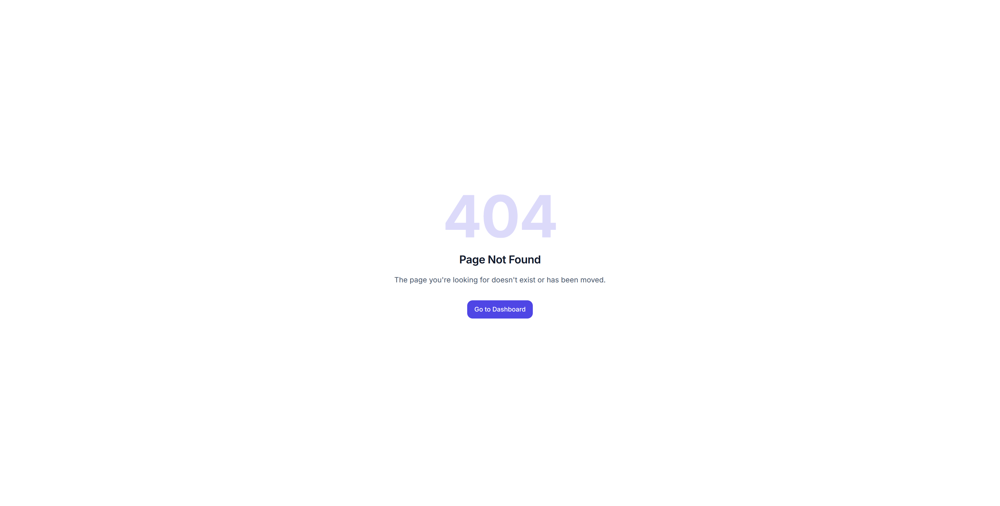

## Step 113: Unknown goal

**URL:** https://nexus-finance-6c6c6.web.app/dashboard

**Action:** save_as_pdf

**Details:** {'save_as_pdf': {'file_name': '41_transactions_with_expense.pdf', 'print_background': True, 'landscape': False, 'scale': 1.0, 'paper_format': 'Letter'}, 'interacted_element': None}

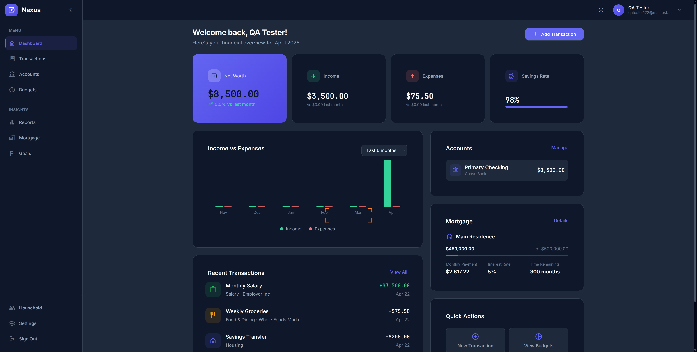

## Step 114: Unknown goal

**URL:** https://nexus-finance-6c6c6.web.app/mortgages

**Action:** click

**Details:** {'click': {'index': 5360}, 'interacted_element': DOMInteractedElement(node_id=21911, backend_node_id=5360, frame_id=None, node_type=<NodeType.ELEMENT_NODE: 1>, node_value='', node_name='BUTTON', attributes={'_ngcontent-ng-c3928296004': '', 'class': 'btn btn-primary'}, bounds=DOMRect(x=1626.3215578198433, y=120.00000953674316, width=184.82144325971603, height=40.00000317891439), x_path='html/body/app-root/app-main-layout/div/div/main/app-transaction-list/div/header/button', element_hash=1104866004922658679, stable_hash=10328238041777434483, ax_name='add Add Transaction')}

## Step 115: Unknown goal

**URL:** https://nexus-finance-6c6c6.web.app/mortgages

**Action:** click

**Details:** {'click': {'index': 6249}, 'interacted_element': DOMInteractedElement(node_id=22877, backend_node_id=6249, frame_id=None, node_type=<NodeType.ELEMENT_NODE: 1>, node_value='', node_name='BUTTON', attributes={'_ngcontent-ng-c3928296004': '', 'type': 'button', 'class': 'type-btn'}, bounds=DOMRect(x=1022.5715098381044, y=164.7410845210155, width=138.8571538925171, height=84.00000667572021), x_path='html/body/app-root/app-main-layout/div/div/main/app-transaction-list/div/div[3]/div/form/div[1]/button[2]', element_hash=2247921742647479487, stable_hash=13777136788715949242, ax_name='trending_up Income')}

## Step 116: Unknown goal

**URL:** https://nexus-finance-6c6c6.web.app/mortgages

**Action:** input

**Details:** {'input': {'index': 6262, 'text': '3500', 'clear': True}, 'interacted_element': DOMInteractedElement(node_id=23727, backend_node_id=6262, frame_id=None, node_type=<NodeType.ELEMENT_NODE: 1>, node_value='', node_name='INPUT', attributes={'_ngcontent-ng-c3928296004': '', 'type': 'number', 'name': 'amount', 'step': '0.01', 'placeholder': '0.00', 'required': '', 'class': 'ng-untouched ng-pristine ng-valid'}, bounds=DOMRect(x=871.7143549919128, y=303.6428812742233, width=450.8571786880493, height=54.285718599955246), x_path='html/body/app-root/app-main-layout/div/div/main/app-transaction-list/div/div[3]/div/form/div[2]/div/input', element_hash=176229503453963786, stable_hash=14520138965206277586, ax_name='0.00')}

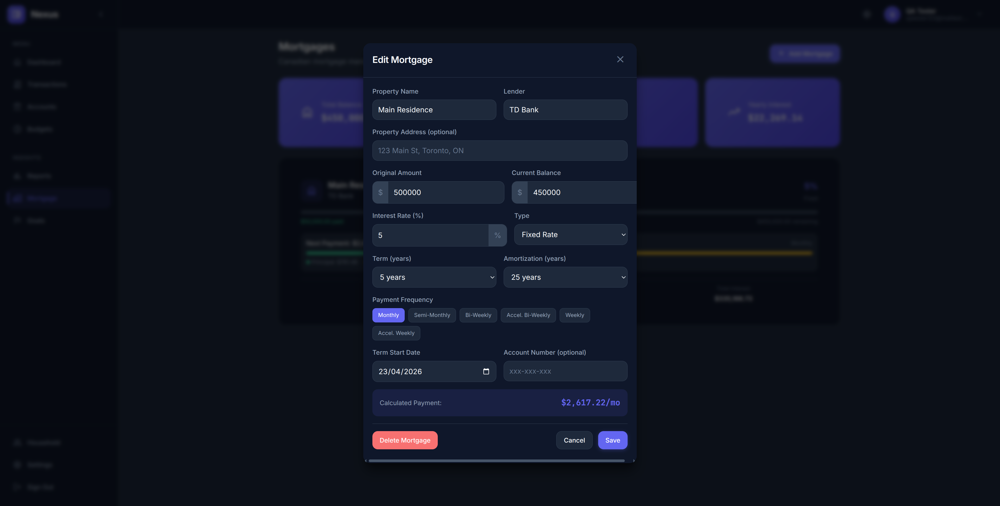

## Step 117: Unknown goal

**URL:** https://nexus-finance-6c6c6.web.app/mortgages

**Action:** input

**Details:** {'input': {'index': 6265, 'text': 'Monthly Salary', 'clear': True}, 'interacted_element': DOMInteractedElement(node_id=23739, backend_node_id=6265, frame_id=None, node_type=<NodeType.ELEMENT_NODE: 1>, node_value='', node_name='INPUT', attributes={'_ngcontent-ng-c3928296004': '', 'type': 'text', 'name': 'description', 'placeholder': 'What was this for?', 'required': '', 'class': 'ng-untouched ng-pristine ng-invalid'}, bounds=DOMRect(x=871.7143549919128, y=406.9286037683487, width=450.8571786880493, height=44.57143211364746), x_path='html/body/app-root/app-main-layout/div/div/main/app-transaction-list/div/div[3]/div/form/div[3]/input', element_hash=937773794508005480, stable_hash=7408376340688513213, ax_name='What was this for?')}

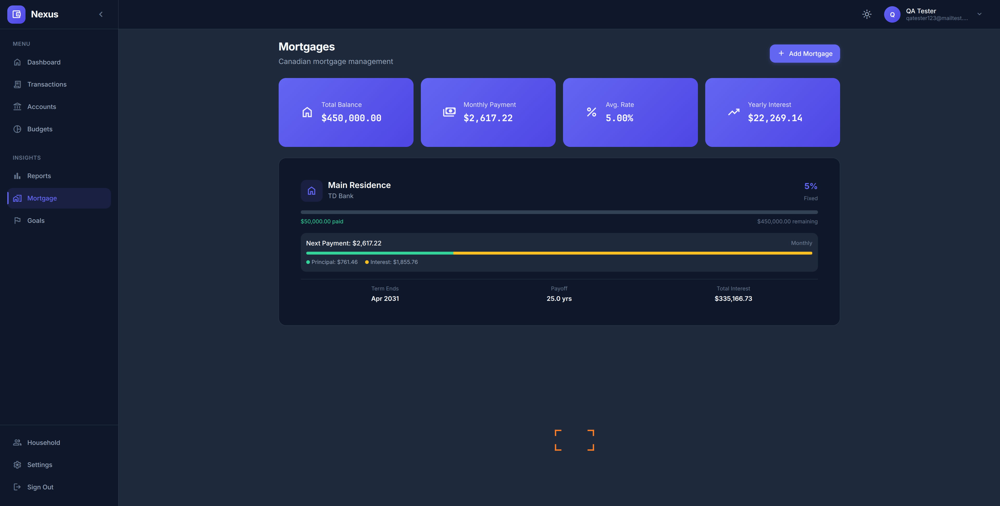

## Step 118: Unknown goal

**URL:** https://nexus-finance-6c6c6.web.app/goals

**Action:** select_dropdown

**Details:** {'select_dropdown': {'index': 6286, 'text': 'Primary Checking'}, 'interacted_element': DOMInteractedElement(node_id=23766, backend_node_id=6286, frame_id=None, node_type=<NodeType.ELEMENT_NODE: 1>, node_value='', node_name='SELECT', attributes={'_ngcontent-ng-c3928296004': '', 'name': 'accountId', 'required': '', 'class': 'ng-untouched ng-pristine ng-invalid'}, bounds=DOMRect(x=871.7143549919128, y=596.0714759429296, width=450.8571786880493, height=45.714289347330734), x_path='html/body/app-root/app-main-layout/div/div/main/app-transaction-list/div/div[3]/div/form/div[5]/select', element_hash=5997806183700159264, stable_hash=12327630401633471267, ax_name=None)}

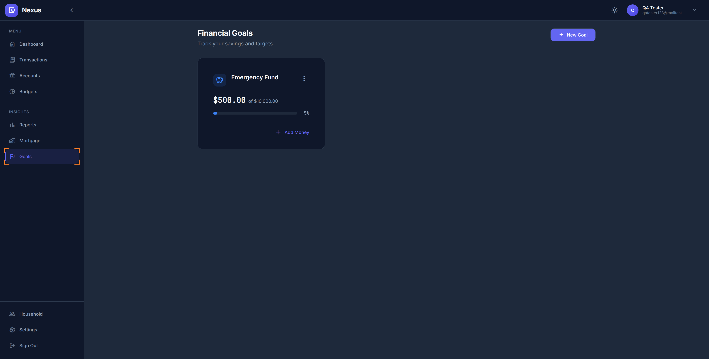

## Step 119: Unknown goal

**URL:** https://nexus-finance-6c6c6.web.app/goals

**Action:** select_dropdown

**Details:** {'select_dropdown': {'index': 6298, 'text': 'Salary'}, 'interacted_element': DOMInteractedElement(node_id=23791, backend_node_id=6298, frame_id=None, node_type=<NodeType.ELEMENT_NODE: 1>, node_value='', node_name='SELECT', attributes={'_ngcontent-ng-c3928296004': '', 'name': 'categoryId', 'class': 'ng-untouched ng-pristine ng-valid'}, bounds=DOMRect(x=871.7143549919128, y=690.7857691844305, width=450.8571786880493, height=45.714289347330734), x_path='html/body/app-root/app-main-layout/div/div/main/app-transaction-list/div/div[3]/div/form/div[6]/select', element_hash=1761915909301262284, stable_hash=7519768860028464379, ax_name=None)}

## Step 120: Unknown goal

**URL:** https://nexus-finance-6c6c6.web.app/goals

**Action:** input

**Details:** {'input': {'index': 6304, 'text': 'Employer Inc', 'clear': True}, 'interacted_element': DOMInteractedElement(node_id=24599, backend_node_id=6304, frame_id=None, node_type=<NodeType.ELEMENT_NODE: 1>, node_value='', node_name='INPUT', attributes={'_ngcontent-ng-c3928296004': '', 'type': 'text', 'name': 'payee', 'placeholder': 'Who did you pay?', 'class': 'ng-untouched ng-pristine ng-valid'}, bounds=DOMRect(x=871.7143549919128, y=785.5000624259313, width=450.8571786880493, height=44.57143211364746), x_path='html/body/app-root/app-main-layout/div/div/main/app-transaction-list/div/div[3]/div/form/div[7]/input', element_hash=146214768672057247, stable_hash=12908104273127944949, ax_name='Who did you pay?')}

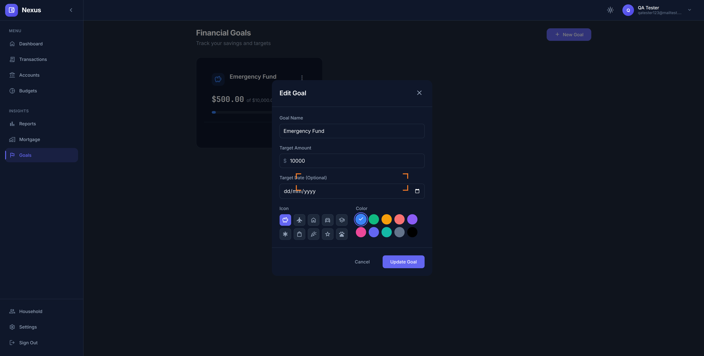

## Step 121: Unknown goal

**URL:** https://nexus-finance-6c6c6.web.app/goals

**Action:** click

**Details:** {'click': {'index': 6373}, 'interacted_element': DOMInteractedElement(node_id=24616, backend_node_id=6373, frame_id=None, node_type=<NodeType.ELEMENT_NODE: 1>, node_value='', node_name='BUTTON', attributes={'_ngcontent-ng-c3928296004': '', 'type': 'submit', 'class': 'btn btn-primary'}, bounds=DOMRect(x=1246.2947419037423, y=989.9286501010259, width=76.27679177622001, height=40.00000317891439), x_path='html/body/app-root/app-main-layout/div/div/main/app-transaction-list/div/div[3]/div/form/div[9]/button[2]', element_hash=917958115495056561, stable_hash=17058859179990914218, ax_name='Add')}

## Step 122: Unknown goal

**URL:** https://nexus-finance-6c6c6.web.app/goals

**Action:** save_as_pdf

**Details:** {'save_as_pdf': {'file_name': '42_transactions_with_income.pdf', 'print_background': True, 'landscape': False, 'scale': 1.0, 'paper_format': 'Letter'}, 'interacted_element': None}

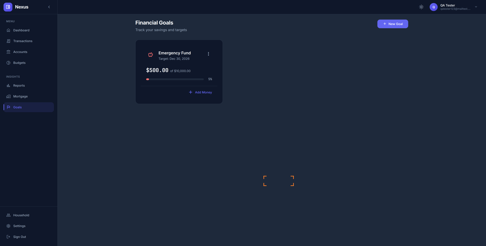

## Step 123: Unknown goal

**URL:** https://nexus-finance-6c6c6.web.app/goals

**Action:** click

**Details:** {'click': {'index': 5360}, 'interacted_element': DOMInteractedElement(node_id=24811, backend_node_id=5360, frame_id=None, node_type=<NodeType.ELEMENT_NODE: 1>, node_value='', node_name='BUTTON', attributes={'_ngcontent-ng-c3928296004': '', 'class': 'btn btn-primary'}, bounds=DOMRect(x=1626.3215578198433, y=120.00000953674316, width=184.82144325971603, height=40.00000317891439), x_path='html/body/app-root/app-main-layout/div/div/main/app-transaction-list/div/header/button', element_hash=1104866004922658679, stable_hash=10328238041777434483, ax_name='add Add Transaction')}

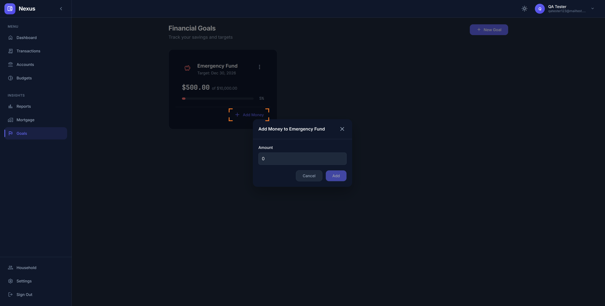

## Step 124: Unknown goal

**URL:** https://nexus-finance-6c6c6.web.app/goals

**Action:** click

**Details:** {'click': {'index': 6853}, 'interacted_element': DOMInteractedElement(node_id=25825, backend_node_id=6853, frame_id=None, node_type=<NodeType.ELEMENT_NODE: 1>, node_value='', node_name='BUTTON', attributes={'_ngcontent-ng-c3928296004': '', 'type': 'button', 'class': 'type-btn'}, bounds=DOMRect(x=1173.4286646842957, y=164.7410845210155, width=138.8571538925171, height=84.00000667572021), x_path='html/body/app-root/app-main-layout/div/div/main/app-transaction-list/div/div[3]/div/form/div[1]/button[3]', element_hash=6663844257750986576, stable_hash=6663844257750986576, ax_name='swap_horiz Transfer')}

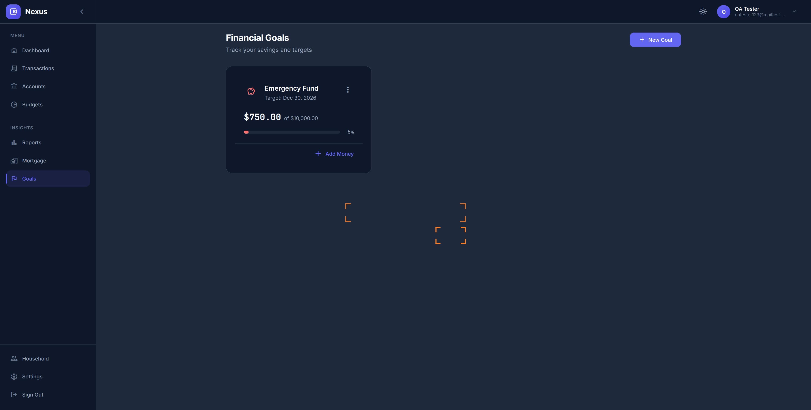

## Step 125: Unknown goal

**URL:** https://nexus-finance-6c6c6.web.app/goals

**Action:** save_as_pdf

**Details:** {'save_as_pdf': {'file_name': '43_add_transaction_transfer_tab.pdf', 'print_background': True, 'landscape': False, 'scale': 1.0, 'paper_format': 'Letter'}, 'interacted_element': None}

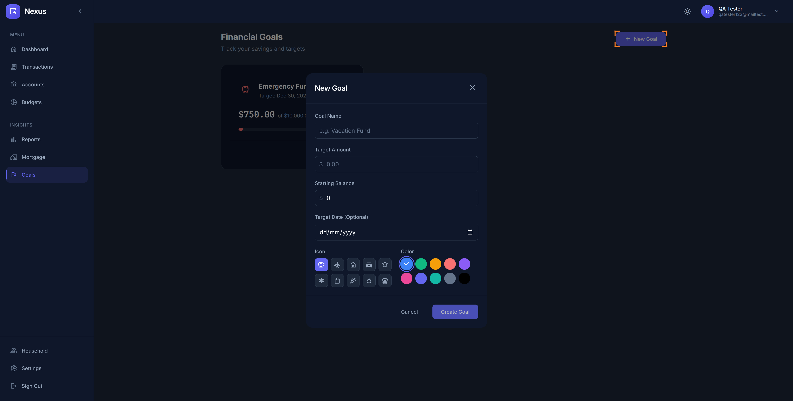

## Step 126: Unknown goal

**URL:** https://nexus-finance-6c6c6.web.app/goals

**Action:** input

**Details:** {'input': {'index': 6864, 'text': '200', 'clear': True}, 'interacted_element': DOMInteractedElement(node_id=26667, backend_node_id=6864, frame_id=None, node_type=<NodeType.ELEMENT_NODE: 1>, node_value='', node_name='INPUT', attributes={'_ngcontent-ng-c3928296004': '', 'type': 'number', 'name': 'amount', 'step': '0.01', 'placeholder': '0.00', 'required': '', 'class': 'ng-untouched ng-pristine ng-valid'}, bounds=DOMRect(x=871.7143549919128, y=303.6428812742233, width=450.8571786880493, height=54.285718599955246), x_path='html/body/app-root/app-main-layout/div/div/main/app-transaction-list/div/div[3]/div/form/div[2]/div/input', element_hash=176229503453963786, stable_hash=14520138965206277586, ax_name='0.00')}

## Step 127: Unknown goal

**URL:** https://nexus-finance-6c6c6.web.app/goals

**Action:** input

**Details:** {'input': {'index': 6867, 'text': 'Savings Transfer', 'clear': True}, 'interacted_element': DOMInteractedElement(node_id=26679, backend_node_id=6867, frame_id=None, node_type=<NodeType.ELEMENT_NODE: 1>, node_value='', node_name='INPUT', attributes={'_ngcontent-ng-c3928296004': '', 'type': 'text', 'name': 'description', 'placeholder': 'What was this for?', 'required': '', 'class': 'ng-untouched ng-pristine ng-invalid'}, bounds=DOMRect(x=871.7143549919128, y=406.9286037683487, width=450.8571786880493, height=44.57143211364746), x_path='html/body/app-root/app-main-layout/div/div/main/app-transaction-list/div/div[3]/div/form/div[3]/input', element_hash=937773794508005480, stable_hash=7408376340688513213, ax_name='What was this for?')}

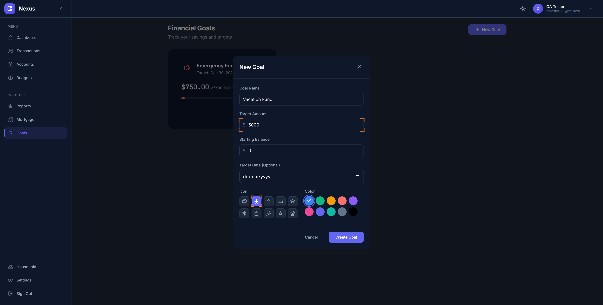

## Step 128: Unknown goal

**URL:** https://nexus-finance-6c6c6.web.app/goals

**Action:** select_dropdown

**Details:** {'select_dropdown': {'index': 6888, 'text': 'Primary Checking'}, 'interacted_element': DOMInteractedElement(node_id=27517, backend_node_id=6888, frame_id=None, node_type=<NodeType.ELEMENT_NODE: 1>, node_value='', node_name='SELECT', attributes={'_ngcontent-ng-c3928296004': '', 'name': 'accountId', 'required': '', 'class': 'ng-untouched ng-pristine ng-invalid'}, bounds=DOMRect(x=871.7143549919128, y=596.0714759429296, width=450.8571786880493, height=45.714289347330734), x_path='html/body/app-root/app-main-layout/div/div/main/app-transaction-list/div/div[3]/div/form/div[5]/select', element_hash=5997806183700159264, stable_hash=12327630401633471267, ax_name=None)}

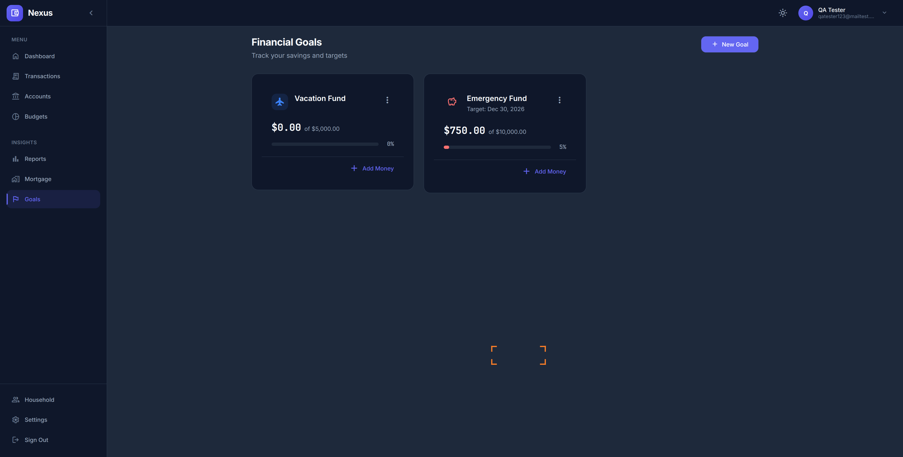

## Step 129: Unknown goal

**URL:** https://nexus-finance-6c6c6.web.app/reports

**Action:** select_dropdown

**Details:** {'select_dropdown': {'index': 6900, 'text': 'Housing'}, 'interacted_element': DOMInteractedElement(node_id=27542, backend_node_id=6900, frame_id=None, node_type=<NodeType.ELEMENT_NODE: 1>, node_value='', node_name='SELECT', attributes={'_ngcontent-ng-c3928296004': '', 'name': 'categoryId', 'class': 'ng-untouched ng-pristine ng-valid'}, bounds=DOMRect(x=871.7143549919128, y=690.7857691844305, width=450.8571786880493, height=45.714289347330734), x_path='html/body/app-root/app-main-layout/div/div/main/app-transaction-list/div/div[3]/div/form/div[6]/select', element_hash=1761915909301262284, stable_hash=7519768860028464379, ax_name=None)}

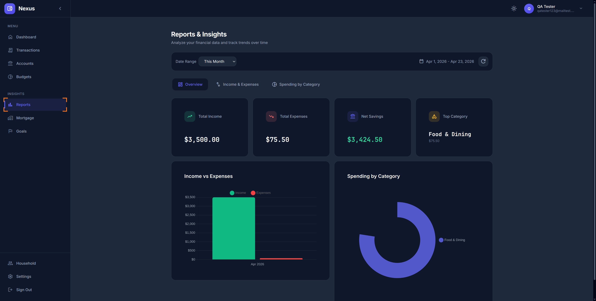

## Step 130: Unknown goal

**URL:** https://nexus-finance-6c6c6.web.app/reports

**Action:** click

**Details:** {'click': {'index': 6975}, 'interacted_element': DOMInteractedElement(node_id=27669, backend_node_id=6975, frame_id=None, node_type=<NodeType.ELEMENT_NODE: 1>, node_value='', node_name='BUTTON', attributes={'_ngcontent-ng-c3928296004': '', 'type': 'submit', 'class': 'btn btn-primary'}, bounds=DOMRect(x=1246.2947419037423, y=989.9286501010259, width=76.27679177622001, height=40.00000317891439), x_path='html/body/app-root/app-main-layout/div/div/main/app-transaction-list/div/div[3]/div/form/div[9]/button[2]', element_hash=917958115495056561, stable_hash=17058859179990914218, ax_name='Add')}

## Step 131: Unknown goal

**URL:** https://nexus-finance-6c6c6.web.app/reports

**Action:** save_as_pdf

**Details:** {'save_as_pdf': {'file_name': '44_transactions_with_all_three.pdf', 'print_background': True, 'landscape': False, 'scale': 1.0, 'paper_format': 'Letter'}, 'interacted_element': None}

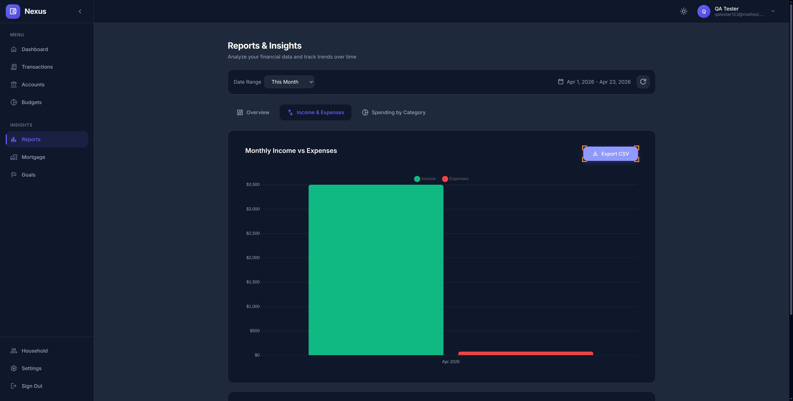

## Step 132: Unknown goal

**URL:** https://nexus-finance-6c6c6.web.app/reports

**Action:** click

**Details:** {'click': {'index': 7285}, 'interacted_element': DOMInteractedElement(node_id=28230, backend_node_id=7285, frame_id=None, node_type=<NodeType.ELEMENT_NODE: 1>, node_value='', node_name='APP-TRANSACTION-ITEM', attributes={'_ngcontent-ng-c3928296004': '', '_nghost-ng-c251063463': ''}, bounds=DOMRect(x=691.7143406867981, y=737.0268442879121, width=1070.8572279612224, height=81.00000643730164), x_path='html/body/app-root/app-main-layout/div/div/main/app-transaction-list/div/app-card/div/div/div[2]/app-transaction-item[1]', element_hash=8584915418974004823, stable_hash=8584915418974004823, ax_name=None)}

